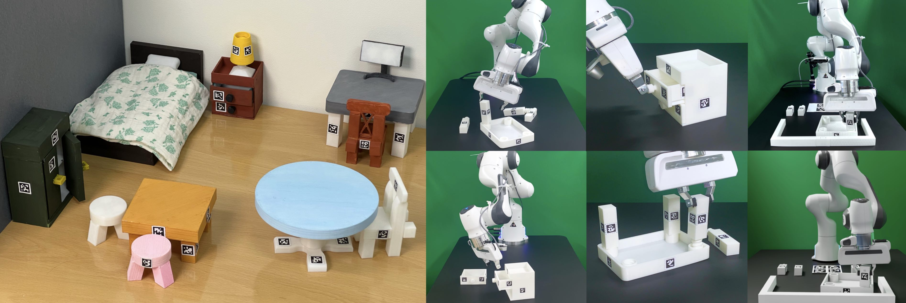

# FurnitureBench: Reproducible Real-World Furniture Assembly Benchmark

[**Paper**](#)
| [**Website**](https://clvrai.github.io/furniture-bench/)
| [**Documentation**](https://clvrai.github.io/furniture-bench/website/build/html/index.html)



FurnitureBench is the real-world furniture assembly benchmark, which aims at providing a reproducible and easy-to-use platform for long-horizon complex robotic manipulation.

It features
- Long-horizon complex manipulation tasks
- Standardized environment setup
- Python-based robot control stack
- FurnitureSim: a simulated environment
- Large-scale teleoperation dataset (200+ hours)

Please check out our [website](https://clvrai.github.io/furniture-bench/) for more details.


## Citation

If you find FurnitureBench useful for your research, please cite this work:
```
@inproceedings{heo2023furniturebench,
    title={FurnitureBench: Reproducible Real-World Benchmark for Long-Horizon Complex Manipulation},
    author={Minho Heo and Youngwoon Lee and Doohyun Lee and Joseph J. Lim},
    booktitle={Robotics: Science and Systems},
    year={2023}
}
```
