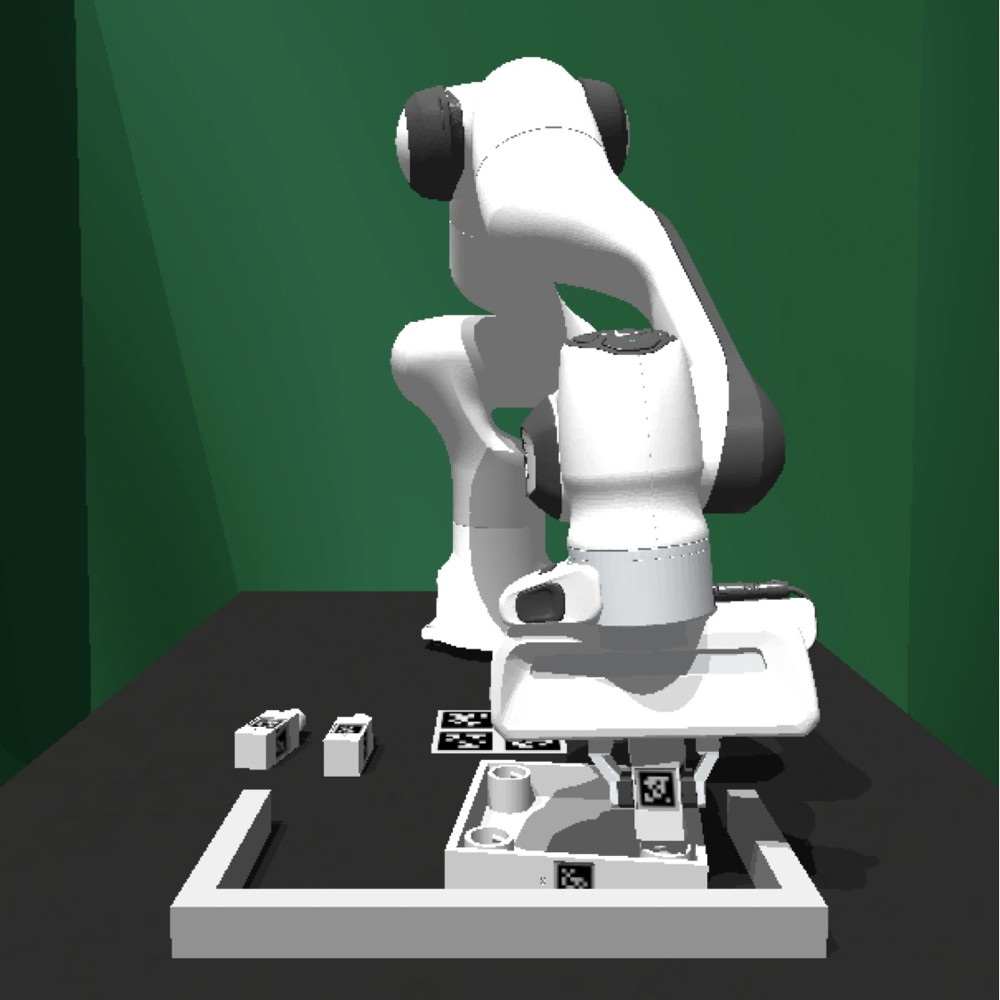
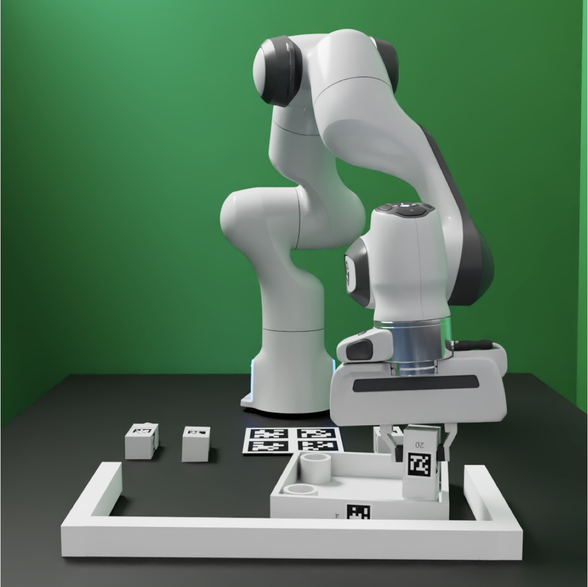

Installation Guide (FurnitureSim)
=========================================================

FurnitureSim is a high-speed and realistic simulation of FurnitureBench, built using Isaac Gym and Factory.
It is designed to be a seamless substitution of the real-world environment, and enables rapid prototyping of new algorithms.

.. |real| image:: ../../_static/images/real.jpg

.. table::
    :widths: 30 30 30

    +------------------+------------------------+-----------------------------+
    | |simulator|      |    |rendering|         |          |real|             |
    +==================+========================+=============================+
    |  \(a) Simluator  | \(b) Offline rendering | \(c) Real-world environment |
    +------------------+------------------------+-----------------------------+

Now we will take a look how to install FurnitureSim.
You can install FurnitureSim using Docker or from source.

.. prerequisites::
    Prerequisites

    -  🛠️ Ubuntu 20.04 LTS
    - NVIDIA RTX GPU
    -  📖 Download `Isaac Gym <https://developer.nvidia.com/isaac-gym>`__
    -  📖 `Anaconda <https://www.anaconda.com/>`__

Downloading Isaac Gym
~~~~~~~~~~~~~~~~~~~~
Our simulator is built on top of Isaac Gym and Factory for, which enable fast and complex physics simulation.
Here we provide installation instructions for Isaac Gym.

- Go to the `website <https://developer.nvidia.com/isaac-gym>`__.
- Start by creating an NVIDIA account, and then click "Member area".
- Kindly review and accept the "Terms of the NVIDIA Isaac Gym License Agreement".
- Download `Isaac Gym - Ubuntu Linux 18.04 / 20.04 Preview 4 release`.
- Unzip the downloaded file and move the folder to the desired location.

Installation using Docker (Option 1)
~~~~~~~~~~~~~~~~~~~

We provide a docker image that includes everything needed for FurnitureSim. To use FurnitureSim, you only need to run our docker image.

1. 📖 Download `nvidia-docker2 <https://docs.nvidia.com/datacenter/cloud-native/container-toolkit/install-guide.html>`__.

2. Set the environment variables by following :ref:`Run Client`.

3. Launch the Docker image with:

  .. code::

    ./launch_client --sim-gpu <--pulled or --built>

Local Installation (Option 2)
~~~~~~~~~~~~~~~~~~~~~~~~~~

You can also install FurnitureSim by manually installing dependencies as follows:

0. Install CUDA (Skip if you already have CUDA installed):

    You can follow the instructions `here <https://docs.nvidia.com/cuda/cuda-installation-guide-linux/index.html>`__, or follow this `gist <https://gist.github.com/primus852/b6bac167509e6f352efb8a462dcf1854#file-cuda_11-7_installation_on_ubuntu_22-04>`__

1. (Optional) Create a conda environment:

    .. code::

        conda create -n furniture-bench python=3.8

2. Install PyTorch:

    .. code::

        # Your specific version.
        # E.g.,
        pip3 install torch torchvision torchaudio
        # Or,
        conda install pytorch torchvision torchaudio cudatoolkit=11.7 -c pytorch -c conda-forge

3. Install Isaac Gym:

    .. code::

        cd </path/to/isaacgym>
        cd python
        pip install -e .

4. Install FurnitureBench:

    .. code::

        git clone https://github.com/clvrai/furniture-bench.git
        cd furniture-bench
        pip install -e .

        # Match the version of setuptools with the packages in the requirements.txt
        pip install --upgrade pip wheel
        pip install setuptools==58
        pip install --upgrade pip==22.2.2

        pip install -r requirements.txt

5. Test the installation:

    .. code::

        python furniture_bench/scripts/run_sim_env.py --furniture one_leg --scripted

Running FurnitureSim
~~~~~~~~~~~~~~~~~~~~

Run Docker image
-----------------

Run the docker image if you did not install the code with local installation.

1. Set the environment variables

  .. code:: bash

    # With display
    xhost +

    export CLIENT_DOCKER=client-gpu                        # (Case1: local build)
    export CLIENT_DOCKER=furniturebench/client-gpu:latest  # (Case2: docker pull)

    # Set absolute path to the furniture-benchmark repo
    export FURNITURE_BENCH=</path/to/furniture-benchmark>

    # Isaac Gym absolute path
    export ISAAC_GYM_PATH=</path/to/isaacgym>         # path to isaacgym downloaded from https://developer.nvidia.com/isaac-gym

    # Launch the image
    cd $FURNITURE_BENCH
    ./launch_client.sh --sim-gpu

Test Run for Simulator
----------------------

.. code:: bash

    cd /furniture-bench

    # args: --furniture [lamp | square_table | desk | drawer | cabinet | round_table | stool | chair | one_leg]

    python furniture_bench/scripts/run_sim_env.py --furniture square_table --no-action
    # Headless
    python furniture_bench/scripts/run_sim_env.py --furniture square_table --no-action --headless

.. tip::

    In FurnitureSim, the 3D furniture models from FurnitureBench are transformed into the Signed Distance Function (SDF) format for use in the simulation.
    The first time the simulator is run, it will take some time (~ few minutes) to generate the SDF meshes, but subsequent runs will be faster as the simulator can load the pre-cached SDF meshes.

FurnitureSim Parameters
~~~~~~~~~~~
Simulation parameters including mass, inertia, dt, etc. can be found in ``furniture_bench/sim_config.py``.

Supported Furniture Models
~~~~~~~~~

The simulator currently supports automatic assembly scripts for the following furniture models.
The script for all furniture models will be available soon.

 ============== =================
   Furniture     Assembly script
 ============== =================
      lamp              ⏳
  square_table          ⏳
      desk              ⏳
  round_table           ⏳
     stool              ⏳
     chair              ⏳
     drawer             ⏳
    cabinet             ⏳
    one_leg             ✔️
 ============== =================
