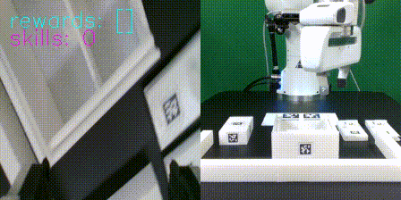
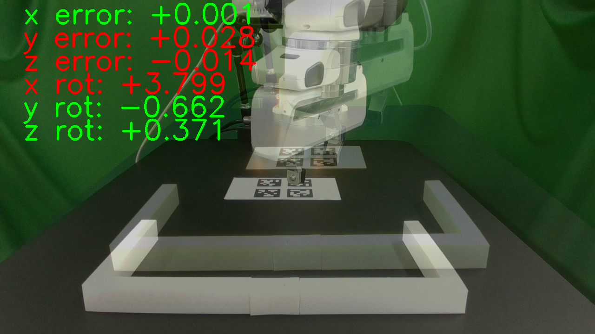

FurnitureBench
=================

Environment
~~~~~~~~~~~~~~~~~~~~~~~~~~~~~~~~~~~~~~~~~
Here we show how to initialize the real-world environment with different arguments.

.. code::

        env = gym.make(
            'Furniture-Env-v0',      # string, environment name.
            furniture=...,           # string, <'lamp' | 'square_table' | 'desk' | 'drawer' | 'cabinet' | 'round_table' | 'stool' | 'chair' | 'one_leg'>.
            manual_done=...,         # boolean, if True, the episode ends only when the user presses the 'done' button.
            with_display=...,        # boolean, if True, the environment renders the camera images.
            draw_marker=...,         # boolean, if True, the environment renders the AprilTag marker.
            manual_label=...,        # boolean, if True, allow manual labeling of the reward.
            from_skill=...,          # integer, [0-5) skill index to start from.
            to_skill=...,            # integer, [1-5] skill index to end at. Should be larger than `from_skill`.
            randomness=...,          # string, <'low' | 'med' | 'high'>, randomness level of the environment.
            high_random_idx=...,     # integer, 0-2, index of the high randomness level.
            visualize_init_pose=..., # boolean, if True, visualize the initial pose of furniture parts.
            record_video=...,        # boolean, if True, record the video of agent's observation
            manual_reset=...,        # boolean, if True, allow manual reset of the environment.
        )

Visualize Camera Inputs
~~~~~~~~~~~~~~~~~~~~~~~

This script allows you to visualize AprilTag detection and the camera from three different views (front, wrist, and rear)

.. image:: ../_static/images/run_cam_april.png
    :width: 600px

.. code::

    python furniture_bench/scripts/run_cam_april.py

Visualize Robot Trajectory
~~~~~~~~~~~~~~~~~~~~~~~

This script will show robot's trajectory saved in a .pkl file.
The wrist and front camera views are shown in the left and right panels, respectively.

If you want to try out with the pre-recorded trajectories, you can download the .pkl files from :ref:`Downloading dataset`.
We run the following commands with cabinet `trajectory <https://drive.google.com/file/d/1PSh0uvhf7nqFw4KYLf4gn4E7GKferUvD/view?usp=share_link>`__

.. code::

    python furniture_bench/scripts/show_trajectory.py --data-path 00149.pkl

Camera Calibration
~~~~~~~~~~~~~~~~~~~~~~~

Our demonstration consists of randomly perturbed front camera pose in each episode.
To determine camera pose from the front-view image, we calculate average camera pose for each type of furniture.

Run the following commands to calibrate front camera pose for each furniture type.

.. code::

    python furniture_bench/scripts/calibration.py --target <furniture_name>

    # e.g. one_leg
    python furniture_bench/scripts/calibration.py --target chair

    The image displays the deviation of the camera pose from the target pose.
    The green/red text shows if the camera pose is within the the threshold or not.
