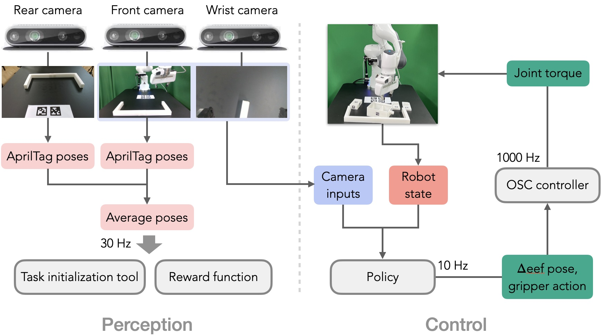

FurnitureBench Overview
=======================

FurnitureBench is a reproducible real-world furniture assembly benchmark for long-horizon and complex robotic manipulation.
To make FurnitureBench **easy to reproduce**, we opt for 3D printing objects when possible and products widely accessible across the world. 

Our real-world system mainly consists of one 7-DoF Franka Emika Panda robot arm with a default parallel gripper and three Intel RealSense D435 RGB-D cameras. For the workspace, we propose to use the black IKEA TOMMARYD table and attach 3D-printed obstacles on the table. The green photography backdrop is used to provide a consistent background and a single light is used to vary lighting conditions.

   **FurnitureBench environment overview.** We illustrate our environment setup (left) and their connections to server and client computers (right). The client handles I/O operations, motion planning, and policy inference while the server manages real-time robot control.

We provide detailed instructions and software tools for the system setup in the :ref:`Installation Guide`, which allows a user to build a new environment with nearly the same configuration.

System overview
~~~~~~~~~~~~~~~

In FurnitureBench, an agent receives an observation (the proprioceptive robot state and images from front and wrist cameras) and takes an action (delta end-effector pose and a gripper action) at a frequency of 10 Hz. For the reward function and initialization tool, we estimate furniture poses using AprilTag from the front-view and rear-view images.

.. FurnitureSim overview
.. ~~~~~~~~~~~~~~~~~~~

.. FurnitureSim is a high-speed and realistic simulation of FurnitureBench, built using IsaacGym and Factory.
.. FurnitureSim is designed to be a seamless substitution of the real-world environment, and enables rapid prototyping of new algorithms.

.. In order to accurately mimic the real-world environment, we use the same 3D furniture models and robot controller used in FurnitureBench.
.. The simulator provides camera observations and robot proprioceptive states, which is processed by an agent that predicts its action as if it were receiving input from the real-world sensors.
.. The controller code, which is also used in FurnitureBench, receives the action commands from the agent and calculates the low-level control commands for the robot.

.. .. |real| image:: ../_static/images/real.jpg
.. .. |sim| image:: ../_static/images/simulator.jpg

.. .. table::
..     :widths: 50 50

..     +------------------------+-----------+
..     | |real|                 | |sim|     |
..     +========================+===========+
..     | Real-world Environment | Simulator |
..     +------------------------+-----------+
