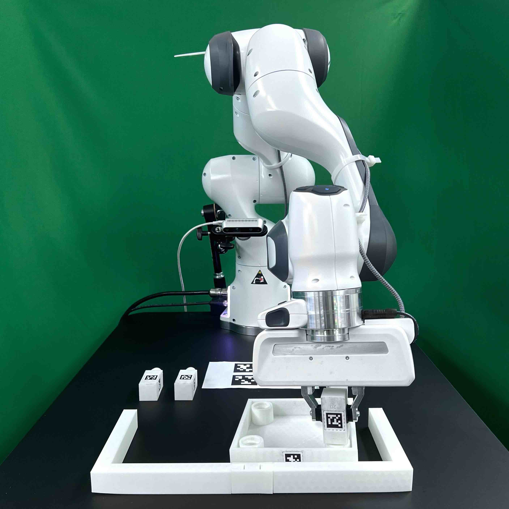

Installing FurnitureSim
=======================

**FurnitureSim** is a realistic simulation of FurnitureBench based on `Isaac Gym <https://developer.nvidia.com/isaac-gym>`__ and `Factory <https://sites.google.com/nvidia.com/factory>`__.
FurnitureSim enables easy and fast evaluation of new algorithms.
You can install FurnitureSim using Docker or build it from source.

.. |simulator| image:: ../_static/images/simulator.jpg
.. |rendering| image:: ../_static/images/rendering.jpg

.. table::
    :widths: 30 30 30

    +------------------+------------------------+-----------------------------+
    | |simulator|      |    |rendering|         |          |real|             |
    +==================+========================+=============================+
    |  \(a) Simluator  | \(b) Offline rendering | \(c) Real-world environment |
    +------------------+------------------------+-----------------------------+

.. prerequisites::
    Prerequisites

    - Ubuntu 20.04 LTS
    - NVIDIA RTX GPU

Download Isaac Gym
~~~~~~~~~~~~~~~~~~

1. Go to the `Isaac Gym website <https://developer.nvidia.com/isaac-gym>`__.
2. Click "Join now" and log into your NVIDIA account.
3. Click "Member area".
4. Read and check the box for the license agreement.
5. Download and unzip ``Isaac Gym - Ubuntu Linux 18.04 / 20.04 Preview 4 release``.

Install FurnitureSim using PyPI (Option 1)
~~~~~~~~~~~~~~~~~~~~~~~~~~~~~~~~~~~~~~~~~~

FurnitureSim is available to install via PyPI. You need an NVIDIA driver and CUDA. Please refer to `NVIDIA CUDA Installation Guide <https://docs.nvidia.com/cuda/cuda-installation-guide-linux/index.html>`__.

1. Install Isaac Gym:

.. code::

  cd <path/to/isaacgym>
  pip install -e python

2. Install FurnitureBench, which includes FurnitureSim:

.. code::

  pip install furniture-bench

Install FurnitureSim using Docker (Option 2)
~~~~~~~~~~~~~~~~~~~~~~~~~~~~~~~~~~~~~~~~~~~~

1. Install `nvidia-docker2 <https://docs.nvidia.com/datacenter/cloud-native/container-toolkit/install-guide.html>`__ and `Anaconda <https://www.anaconda.com/>`__.

2. Specify whether to pull the client Docker image from Docker Hub or build it locally:

.. code:: bash

  # Case 1: pull from Docker Hub
  export CLIENT_DOCKER=furniturebench/client-gpu:latest

  # Case 2: build locally
  export CLIENT_DOCKER=client-gpu

3. Set the environment variables following :ref:`Run Client`.

.. code:: bash

  # With display
  xhost +

  # Set the absolute path to the furniture-bench repo
  export FURNITURE_BENCH=<path/to/furniture-bench>

  # Set the absolute path to Isaac Gym
  export ISAAC_GYM_PATH=<path/to/isaacgym>

4. Launch the Docker image:

.. code::

  ./launch_client.sh --sim-gpu

Test FurnitureSim Installation
~~~~~~~~~~~~~~~~~~~~~~~~~~~~~~

- Test FurnitureSim using the following command with a furniture name ``<furniture>=[lamp|square_table|desk|drawer|cabinet|round_table|stool|chair|one_leg]``.

.. code:: bash

  python -m furniture_bench.scripts.run_sim_env --furniture <furniture> --no-action

- You can run our scripted agent for ``one_leg`` by adding ``--scripted`` to the arguments:

.. code:: bash

  python -m furniture_bench.scripts.run_sim_env --furniture one_leg --scripted

.. note::

    FurnitureSim may take several minutes to convert 3D furniture meshes into Signed Distance Functions (SDF) on your first run. The converted SDF models will then be cached for fast execution.

FurnitureSim Parameters
~~~~~~~~~~~~~~~~~~~~~~~

The simulation parameters (e.g., mass, inertia, and dt) can be found in ``furniture_bench/sim_config.py``.
