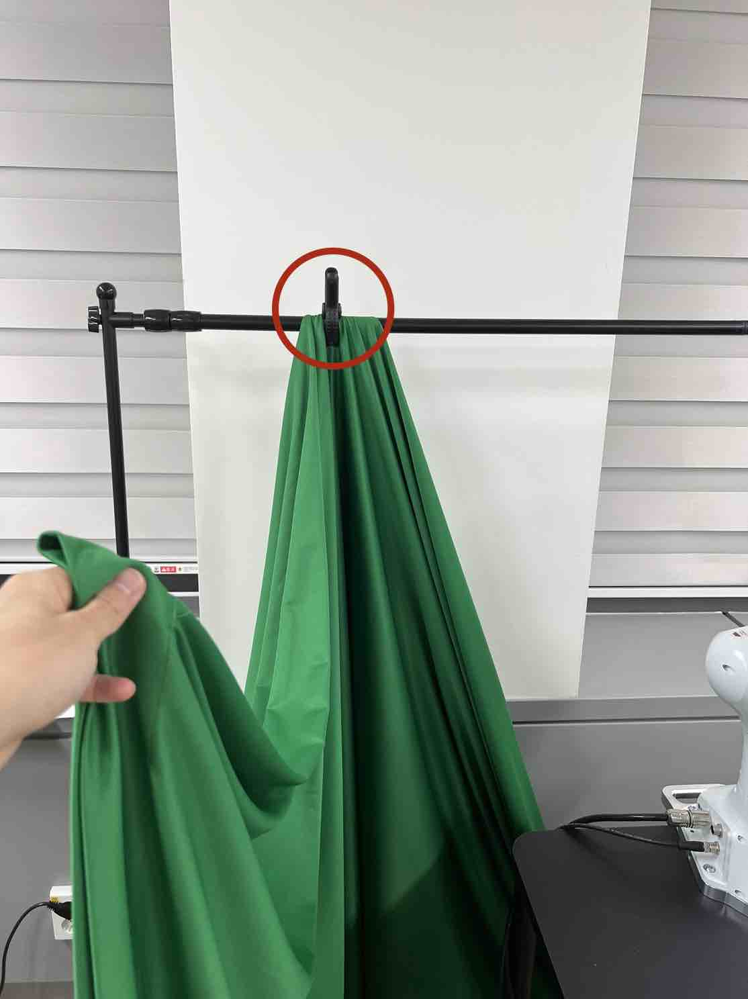
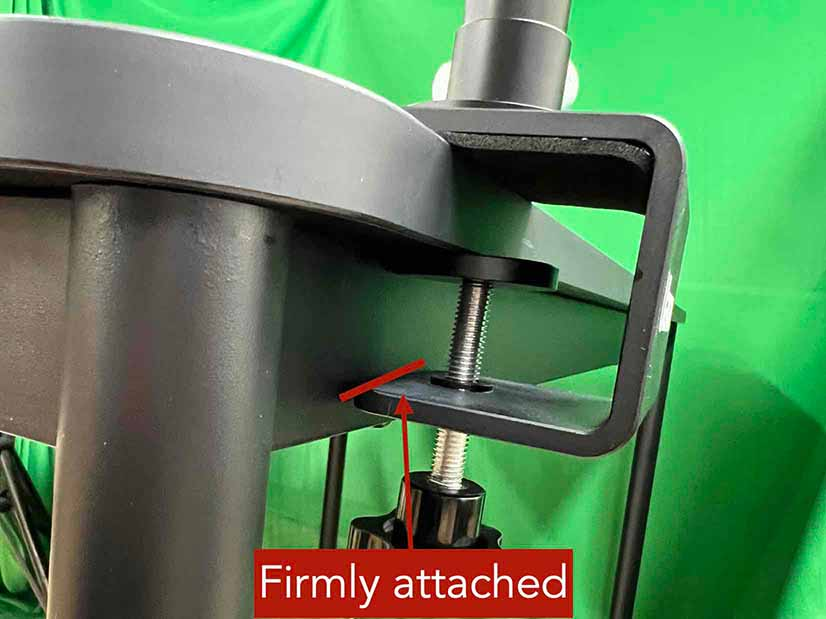
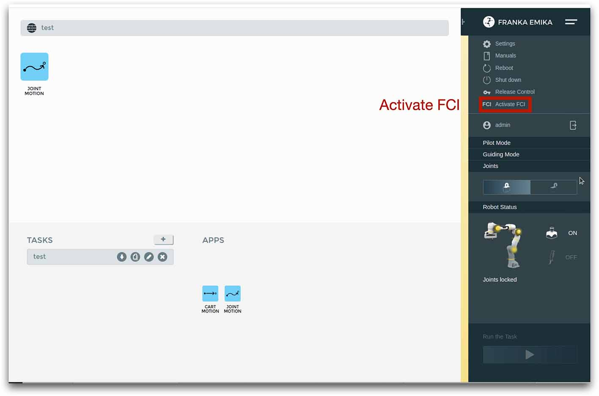
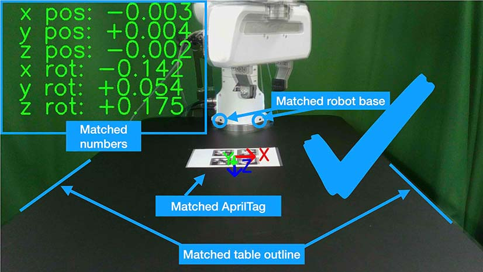

Installing FurnitureBench
=========================

This page provides a step-by-step installation guide of our real-world environment, including hardware and software setups.

Shopping List 🛒
~~~~~~~~~~~~~~~~~

- 🤖 Franka Emika Panda `(link) <https://www.franka.de/>`__ and bench clamp `(link) <https://download.franka.de/Bench_Clamp.pdf>`__
- 3x Intel RealSense D435 `(link) <https://store.intelrealsense.com/buy-intel-realsense-depth-camera-d435.html>`__
- Rear camera arm and mount:
    - Manfrotto Variable Friction Arm with Camera Bracket `(link) <https://www.manfrotto.com/us-en/photo-variable-friction-arm-with-bracket-244/>`__
    - Manfrotto Super Clamp `(link) <https://www.manfrotto.com/global/super-clamp-w-lt-stud-1-4-2900-035rl/>`__
- Front camera arm and mount:
    - Option 1 [#f1]_:
        - Ulanzi ULS01 camera mount `(link) <https://www.amazon.com/Flexible-Adjustable-Articulated-Rotatable-Aluminum/dp/B08LV7GZVB?th=1>`__
    - Option 2:
        - Manfrotto Variable Friction Arm with Camera Bracket `(link) <https://www.manfrotto.com/us-en/photo-variable-friction-arm-with-bracket-244/>`__
        - Manfrotto Super Clamp `(link) <https://www.manfrotto.com/global/super-clamp-w-lt-stud-1-4-2900-035rl/>`__
- Black IKEA TOMMARYD table `(link) <https://www.ikea.com/us/en/p/tommaryd-table-anthracite-s99304804/>`__
- Background frame (larger than w x h: 190 cm x 150 cm)
- 2x tripod (extends longer than 1.2 m in height)
- Green photography backdrop (comparable to w x h: 280 cm x 400 cm for wide-angle coverage)
- 1x LED light panel supporting color temperature (4600 K-6000 K) and brightness (4000 lm)
- 4x 10 feet USB Type-C to Type-A 3.1 cables `(link) <https://www.amazon.com/AmazonBasics-Double-Braided-Nylon-Type-C/dp/B07D7NNJ61>`__
- 🖥️ Server computer (an 8th gen i7 or AMD Ryzen 5 5600X processors, or better)
- 🖥️ Client computer (an Intel 8th generation i7 or AMD Ryzen 5 5600X processor, four USB 3 Type-A ports with high bandwidth, and a NVIDIA RTX 3070 GPU, or better)
- (Optional) Oculus Quest 2 `(link) <https://store.facebook.com/quest/products/quest-2/>`__
- 3D printer
- White PLA 3D printer filament (density of 1.27 g/cm^3)
- Double-sided rubber tape
- Any keyboard and mouse
- 1x plastic ruler and 1x tape ruler
- 2x M3x10mm hex socket screw for the wrist camera
- 1x M6x25mm hex socket screw for the wrist camera

FurnitureBench Prerequisites
~~~~~~~~~~~~~~~~~~~~~~~~~~~~

- Franka Panda system
    -  📖 `Franka Control Interface (FCI) 4.2.2 <https://frankaemika.github.io/docs/libfranka_changelog.html#id1>`__
- Client computer
    -  🛠️ Ubuntu 20.04 LTS PC, with CUDA driver available
    -  📖 `Docker <https://docs.docker.com/engine/install/ubuntu/>`__
    -  📖 `nvidia-docker2 <https://docs.nvidia.com/datacenter/cloud-native/container-toolkit/install-guide.html#installing-on-ubuntu-and-debian>`__
- Server computer
    -  🛠️ Ubuntu 20.04 LTS PC, `real-time kernel <https://frankaemika.github.io/docs/installation_linux.html#setting-up-the-real-time-kernel>`__ installed.
    -  📖 `Docker <https://docs.docker.com/engine/install/ubuntu/>`__

Print 3D Furniture Models 🪑
~~~~~~~~~~~~~~~~~~~~~~~~~~~~~~

Printing 3D furniture models, obstacles, and a camera mount of our FurnitureBench may take a long time (10-23 hours).
Thus, we recommend to 3D print the models before you start installing the real-robot environment. Please refer to :ref:`3D Printing 🖨️` to learn more about 3D printing.

1. Download STL files you want to experiment with from `3D model Google Drive <https://drive.google.com/drive/folders/1Boj7pyNWklOUVA0ByO0d-J7DM7xfFfRg?usp=sharing>`__.
2. Slice the STL files and add support structures using a 3D printer software. In our experiments, we used `FlashPrint <https://www.flashforge.com/product-detail/FlashPrint-slicer-for-flashforge-fdm-3d-printers>`__ with the PLA filament and *fast* option.

Attach AprilTag to Furniture
~~~~~~~~~~~~~~~~~~~~~~~~~~~~

1. Print AprilTags in `A4 <https://drive.google.com/file/d/11wwA3IrXjIVSwVy1sp0hLcB8-J_9rAxJ/view?usp=sharing>`__ or `US Letter <https://drive.google.com/file/d/1eIG3YspcSumtT-o9NvtCvUtRDWPW5hhU/view?usp=sharing>`__ size. Do **NOT** change the aspect ratio and scale.
2. Attach AprilTags to the furniture parts. A furniture part has a placeholder with an ID of its corresponding AprilTag.

.. checklist::

    Attach AprilTags such that they are oriented correctly:

    -  When cutting the tags from the printed paper, make sure that the printed paper is correctly oriented, allowing you to read the words and numbers from left to right and top to bottom. |apriltag_uncheck_1|
    -  Before attaching the tag to the furniture piece, do NOT alter the orientation of the AprilTag from how it was when you cut it out. |apriltag_uncheck_2|
    -  While attaching the tag, ensure that the number on the corresponding furniture piece is also properly oriented, allowing for left-to-right readability. |apriltag_uncheck_3|

    Use the below example for a sanity check:

    .. |image1| image:: ../_static/images/tag10.jpg
        :width: 130px
        :height: 130px
    .. |image2| image:: ../_static/images/correct_attach.jpg
        :width: 130px
        :height: 180px
    .. |image3| image:: ../_static/images/wrong_attach.jpg
        :width: 130px
        :height: 180px

    +-----------------------------------+--------------------------+-------------------------------------------+
    | |image1|                          |            |image2|      |         |image3|                          |
    +===================================+==========================+===========================================+
    | \(a) square_table leg1 (10)       |  \(b) Correct            |  \(c) Wrong                               |
    +-----------------------------------+--------------------------+-------------------------------------------+

Mount Robot on Table
~~~~~~~~~~~~~~~~~~~~
The first step of our robot environment setup is to mount the robot on the table. To ensure the precise placement of the robot, follow the step-by-step
instructions:

1. As shown in (a), attach marking tapes to the robot body to specify its center. Make sure that the tape's left edge is in the center of the triangle sticker and the tape is attached straight by looking at it from the front view.
2. Align one ruler so that 0 cm is at the left edge of the table and extend it straight, as shown in (b).
3. Place the robot strictly at point 34.5 cm of the ruler. Especially, match the center of the robot indicated by the left edge of the tape, as shown in (c).
4. Make sure the robot is tightly attached to the side of the table, with no room left between it and the table. To double-check, make sure that both rear support pads are closely pressed against the edge of the table and that there is no space left in between, as shown in (d).
5. Firmly attach the robot to the table by tightly screwing the robot mount, as shown in (e).
6. Remove the affixed tape from the robot once this step is completed.

.. |table_image1| image:: ../_static/instruction/center_of_robot_base.jpg

.. |table_image3| image:: ../_static/instruction/robot_base.jpg
.. |table_image4| image:: ../_static/instruction/robot_mount.jpg
.. |table_image5| image:: ../_static/instruction/firm_screw.jpg

.. table::
    :widths: 20 20 20 20 20

    +---------------------------+----------------------+------------------------------+----------------------------------------------------------------------+-------------------------+
    |      |table_image1|       |    |table_image2|    |        |table_image3|        |                            |table_image4|                            |     |table_image5|      |
    +===========================+======================+==============================+======================================================================+=========================+
    | \(a) Center of the robot  | \(b) Ruler on table  | \(c) Robot position on table | \(d) Bottom-up view. Two rear supports are indicated by blue circles | \(e) Screwing the mount |
    +---------------------------+----------------------+------------------------------+----------------------------------------------------------------------+-------------------------+

.. Checklist::

    - Make sure the robot is installed at 34.5 cm off from the left edge of the table. |mount_uncheck_1|
    - The robot should be tightly attached to the table without margin. |mount_uncheck_2|
    - The robot mount is tightly screwed. |mount_uncheck_3|

Install Background
~~~~~~~~~~~~~~~~~~

.. |background_image4| image:: ../_static/instruction/background_left_pole_covered.jpg

For consistent background across different lab environments, cover the background
with a green backdrop.

1. Clamp the left side of the backdrop, as shown in (a). Be sure to leave some extra cloth to ensure coverage of the left side as well.
2. Similarly, clamp the right side of the backdrop, as shown in (b).
3. Place a tripod next to the table, and hang the left side of the backdrop to the tripod, as shown in (c) and (d).
4. Repeat this process for the right side.
5. Eventually, The background should look like figure on the right.

.. table::
    :widths: 25 25 25 25

    +----------------------------+-----------------------------+---------------------+------------------------+
    |    |background_image1|     |     |background_image2|     | |background_image3| |  |background_image4|   |
    +============================+=============================+=====================+========================+
    | \(a) Background left clamp | \(b) Background right clamp |   \(c) Left pole    | \(d) Left pole covered |
    +----------------------------+-----------------------------+---------------------+------------------------+

.. Checklist::

    - Make sure there are minimum wrinkles and shadows on the cloth. |background_uncheck_1|
    - Green cloth fully covers the narrow side of the table. |background_uncheck_2|
    - Green cloth covers the left and right edge of the table (at least 1/3 of length) so that the cameras are not disturbed by background noise. |background_uncheck_3|

Attach Base AprilTag
~~~~~~~~~~~~~~~~~~~~~

The base AprilTag defines the world coordinate system; therefore, the camera will be set relative to this base tag. The position and angle of the base tag are critical for reproducibility; thus the placement of the base tag on the table should be precise.
Be cautious when attaching the AprilTag, as it can easily be attached with tilted angles. Ensure that both the rulers and AprilTag are properly aligned and straight.

1. Align the tape ruler so that 0 cm is at the left of the table and plastic ruler so that 0 cm is at the top edge of the table, as illustrated in (a).
2. Place the center of the base tag at 24.5 cm horizontally (24 cm with US Letter) and 37.5 cm vertically, as shown in (b). Make sure the two rulers are perpendicular.
3. Check the direction of the base tag by observing its pattern: correct direction in (c).
4. Use double-sided tape to affix the base tag. Note that wrinkled paper causes unreliable detection. Ensure the paper remains flat by attaching it with double-sided tape in all four corners.

.. |base_apriltag_example| image:: ../_static/instruction/wrong_base_dir.jpg

.. table::
    :widths: 25 25 25 25

    +--------------------------------------+---------------------------------------+-----------------------------------+-------------------------------------------------+
    | |base_apriltag_ruler|                |    |base_apriltag_coordinate|         | |base_apriltag_placement|         | |base_apriltag_example|                         |
    +======================================+=======================================+===================================+=================================================+
    | \(a) Rulers on table                 | \(b) Base tag position on table       | \(c) Correct base tag direction   | \(d) Wrong base tag diretion                    |
    +--------------------------------------+---------------------------------------+-----------------------------------+-------------------------------------------------+

.. checklist::

    - Double-check the base AprilTag in the exact position (like, less than 2 mm error). |base_uncheck_1|
    - The base AprilTag is firmly attached flat without wrinkles. |base_uncheck_2|
    - Check the pattern of the base tag to ensure its correct direction. |base_uncheck_3|

Install Front and Rear Cameras
~~~~~~~~~~~~~~~~~~~~~~~~~~~~~~

.. .. image:: ../_static/instruction/camera_serial.jpg
..     :width: 30%
..     :align: right
..     :alt: camera_serial

.. |camera_serial_realsense_viewer| image:: ../_static/instruction/serial_realsense_viewer.jpg
    :scale: 15

Our system requires three cameras: front, rear, and wrist cameras. Prior to installation, determine
the specific camera to be used for each view, and write down the serial numbers of the wrist, front, and rear cameras, as they will be required for subsequent connections.
A camera serial number can be found in (a) a label on the camera bottom, and (b) `realsense-viewer <https://github.com/IntelRealSense/librealsense/blob/master/doc/distribution_linux.md>`__ software.

.. table::
    :widths: 15 15

    +--------------------------------------------------------+----------------------------------------+
    | |camera_serial|                                        | |camera_serial_realsense_viewer|       |
    +========================================================+========================================+
    | \(a) Serial number written on the bottom of the camera | \(b) Serial number in realsense-viewer |
    +--------------------------------------------------------+----------------------------------------+

Then, install the front and rear cameras. You can utilize any camera mount for the **front
camera** if they follow the instructions and match the camera views. We, however, highly
recommend users opt for a camera mount from either Ulanzi or Manfrotto, both of which we have
confirmed to be reliable. In this context, we provide a guide on how to install these specific mounts,
although you have the flexibility to adjust it during fine-grained calibration in a later section.

.. |front_camera_position| image:: ../_static/instruction/front_camera_position.jpg
.. |front_camera_distance| image:: ../_static/instruction/front_camera_distance.jpg

.. |manfrotto_front_camera_position| image:: ../_static/instruction/manfrotto_front_camera_position.jpg
.. |manfrotto_front_camera_distance| image:: ../_static/instruction/manfrotto_front_camera_distance.jpg
.. |manfrotto_front_camera_firmly_attached| image:: ../_static/instruction/manfrotto_front_camera_firmly_attached.jpg

- **Option 1, Ulanzi:** Clamp the front camera mount to the right side of the table, as shown in (1-a). Position the camera mount 8 cm away from the table edge, as shown in (1-b). While measuring the distance, ensure the camera mount's base is firmly attached, as illustrated in (1-c).

  .. table::
      :widths: 30 30 30

      +------------------------------+------------------------------+--------------------------------+
      | |front_camera_position|      | |front_camera_distance|      | |front_camera_firmly_attached| |
      +==============================+==============================+================================+
      | \(1-a) Front camera position | \(1-b) Front camera distance | \(1-c) Attachment              |
      +------------------------------+------------------------------+--------------------------------+

- **Option 2, Manfrotto:** Clamp the front camera mount to the right side of the table. The camera bracket needs to be affixed using the left hole and the locking wheel should be oriented outward, as shown in (2-a). Position the camera mount 7 cm away from the table edge, as shown in (2-b).  Arrange the deeper section to face the inside to provide better flexibility in camera movement. During the distance measurement, make sure that the camera mount's base is firmly attached and valves are securely fastened, as shown in (2-c).

  .. table::
      :widths: 30 30 30

      +-----------------------------------+-----------------------------------+------------------------------------------+
      | |manfrotto_front_camera_position| | |manfrotto_front_camera_distance| | |manfrotto_front_camera_firmly_attached| |
      +===================================+===================================+==========================================+
      | \(2-a) Front camera position      | \(2-b) Front camera distance      | \(2-c) Attachment                        |
      +-----------------------------------+-----------------------------------+------------------------------------------+

1. Place the camera approximately in the center (horizontally) of the table and orient it to face the base AprilTag. You will fine-tune its pose in a later section.
2. Connect the front camera to client computer using a USB 3.1 cable.
3. Clamp the rear camera mount next to the robot base, as shown in (d). Plug USB 3.1 cable. Utilize a cable tie to fasten the pair of cables from the robot and the single cable from the camera. Ensure a sufficient gap between the camera mount and the robot to avoid any collision.

    \(d) Rear camera installation

Install Wrist Camera
~~~~~~~~~~~~~~~~~~~~

1. Install the wrist camera on the robot wrist using the 3D printed camera mount. Take note of the direction in which the RGB camera (represented with the yellow circles) should face: it should be aimed toward the gripper's tip, as shown in (b). The camera should be positioned on the rear side of the end-effector. Take a look at (c) and (d) to gain a clear understanding of its placement.
2. Connect the wrist camera to client computer using a USB 3.1 cable.
3. Fasten the cable to the robot arm with three cable ties, as shown in (d). Ensure to provide additional slack in the cable, allowing the robot to move without any tension from the cable. Trim the surplus length from the cable ties to ensure no extra material remains.

.. |wrist_camera| image:: ../_static/instruction/camera_down_view.jpg

.. table::
    :widths: 25 25 25

    +--------------------------------+-------------------+---------------------+
    | |camera_mount_screw|           | |wrist_camera|    | |wrist_camera2|     |
    +================================+===================+=====================+
    | \(a) Camera, mount, and screws | \(b) Wrist camera | \(c) Wrist camera   |
    +--------------------------------+-------------------+---------------------+

.. figure:: ../_static/instruction/cable_tie.jpg
    :width: 60%
    :alt: cable_organization

    \(d) Cable organization

.. checklist::

    - Ensure the direction of the wrist camera is correctly set. The camera is positioned on end-effector's back side, and the cable is plugged to the left when viewed from the back. Firmly attach the camera and camera mount to the robot by tightening the screws. |wrist_uncheck_1|
    - Three cable ties are fastened as shown in (d). |wrist_uncheck_2|
    - The cable has additional slack. |wrist_uncheck_3|
    - The surplus length from the cable ties is trimmed. |wrist_uncheck_4|

Install Software
~~~~~~~~~~~~~~~~

We install our software stack using Docker due to complex dependencies and customized packages for our setup (e.g., custom `Polymetis <https://github.com/facebookresearch/fairo/tree/main/polymetis>`__).

Install Client Software
-----------------------

We provide a Docker image for data collection, training, and evaluation. We provide both CPU and GPU versions. The GPU-enabled image is built upon ``nvidia/cuda:11.8.0-cudnn8-devel-ubuntu20.04`` and requires a machine to have a proper CUDA driver (515.105.01 in our case). Please refer to `"compatibility of CUDA with different driver versions" <https://docs.nvidia.com/deploy/cuda-compatibility/index.html#deployment-consideration-forward>`__ for details.

1. Clone the ``furniture-bench`` repository on the client computer. We mount it into the Docker image to enable editing the code on the host machine.

.. code:: bash

  git clone https://github.com/clvrai/furniture-bench.git
  cd furniture-bench

2. There are two ways to build the client Docker image:

  - Pull the pre-built Docker image from Docker Hub.

    .. code:: bash

      # GPU version
      docker pull furniturebench/client-gpu:latest

      # CPU-only version
      docker pull furniturebench/client:latest

  - Or build the Docker image.

    .. code:: bash

      # GPU version
      DOCKER_BUILDKIT=1 docker build -t client-gpu . -f docker/client_gpu.Dockerfile

      # CPU-only version
      DOCKER_BUILDKIT=1 docker build -t client . -f docker/client.Dockerfile

Install Server Software
-----------------------

The server computer needs a real-time kernel and high-speed CPU (e.g., at least Intel i7 8th generation or AMD Ryzen 5 5600X CPU) for high frequency robot control of a Franka Panda arm. Similar to the client computer, we install the server software using Docker:

1. Clone the ``furniture-bench`` repository on the server computer.

.. code:: bash

  git clone https://github.com/clvrai/furniture-bench.git
  cd furniture-bench

2. There are two ways to build the server Docker image:

  - Pull the pre-built Docker image from Docker Hub.

    .. code:: bash

       docker pull furniturebench/server:latest

  - Or build the Docker image.

    .. code:: bash

       DOCKER_BUILDKIT=1 docker build -t server . -f docker/server.Dockerfile

Run Client
~~~~~~~~~~

1. Set up the environment variables. Consider storing variables in ``.bashrc`` or ``.zshrc`` so that you don't have to set them every time.

  - Set the absolute path to the ``furniture-bench`` repo.

    .. code:: bash

      export FURNITURE_BENCH=<path/to/furniture-bench>

  - (Optional) If you want to use FurnitureSim, specify the absolute path to IsaacGym downloaded from https://developer.nvidia.com/isaac-gym.

    .. code:: bash

      export ISAAC_GYM_PATH=<path/to/isaacgym>

  - (Optional) Environment variable for extra mounting (e.g., for data collection). This will set Docker Volume flag ``-v $HOST_DATA_MOUNT:$CONTAINER_DATA_MOUNT``.

    .. code:: bash

      export HOST_DATA_MOUNT=<path/to/host_dir>
      export CONTAINER_DATA_MOUNT=<path/to/container_dir>

2. Run the client image. ``launch_client.sh`` will read the environment variables and run the Docker image. You need to specify the option (``--gpu``, ``--cpu``, ``--sim-gpu``) and the image type (``--built`` or ``--pulled``).

.. code:: bash

  # GPU image + locally built
  ./launch_client.sh --gpu --built

  # CPU image + pulled from Docker Hub
  ./launch_client.sh --cpu --pulled

  # GPU image with FurnitureSim + pulled from Docker Hub
  ./launch_client.sh --sim-gpu --pulled

.. tip::

    - The ``--gpu`` and ``--sim-gpu`` options share the same underlying Docker image. The only difference between them is that the ``--sim-gpu`` option verifies whether the IsaacGym is properly installed and its path is correctly set. If not, an error message will be displayed and the program will be terminated.
    - If you use a Docker image other than ``--pulled`` or ``--built``, you can specify the image name using ``CLIENT_DOCKER`` environment variable. For example, ``export CLIENT_DOCKER=custom-built``. Once set, you can execute ``launch_client.sh`` with a single argument, such as ``./launch_client.sh --gpu``. This command will internally read the environment variable and run the custom-built Docker image.

Set Up Connection
~~~~~~~~~~~~~~~~~

The server, client, and robot communicate through a local Ethernet network, as shown in the figure on the right.

To establish connections to the server and cameras, the client Docker container needs the following environment variables to be set:

.. code-block:: bash

    export SERVER_IP=<IP of the server computer>  # e.g., 192.168.0.138
    export CAM_WRIST_SERIAL=<serial number of the wrist camera>
    export CAM_FRONT_SERIAL=<serial number of the front camera>
    export CAM_REAR_SERIAL=<serial number of the rear camera>

To maintain the connection permanently, you can modify lines 12-15 in ``furniture_bench/config.py``:

.. code-block:: bash

    SERVER_IP = os.getenv("SERVER_IP", "<IP of the server computer>")
    CAM_WRIST_SERIAL = os.getenv("CAM_WRIST_SERIAL", "<serial number of the wrist camera>")
    CAM_FRONT_SERIAL = os.getenv("CAM_FRONT_SERIAL", "<serial number of the front camera>")
    CAM_REAR_SERIAL = os.getenv("CAM_REAR_SERIAL", "<serial number of the rear camera>")

To make sure that all the cameras are correctly installed and appropriately connected, execute the following command in the client Docker container and confirm the items in the checklist.

.. code-block:: bash

    cd /furniture-bench
    python furniture_bench/scripts/run_cam_april.py

    Camera observations

.. checklist::

    - Ensure that the camera displays the wrist, front, and rear views in left-to-right order, as shown in the image above. |connection_uncheck_1|
    - The wrist camera view must observe both gripper tips as shown in the left image. |connection_uncheck_2|
    - The rear camera should be able to detect the two markers present on the base tag, as shown in the right image. |connection_uncheck_3|

Run Server
~~~~~~~~~~

To operate the robot, you need to activate FCI (Franka Control Interface) and launch a server-side daemon as explained below:

1. Access the control interface website.
2. Unlock the robot in the Franka Emika web interface, as shown in (a).
3. Release the activation button, as shown in (b). The light on the robot base should turn blue after releasing the button.
4. Activate FCI in the web interface, as shown in (c).

.. |release_activation| image:: ../_static/instruction/release_activation.png

.. table::
    :widths: 30 30 30

    +-------------+-------------------------+-------------------+
    | |unlock|    | |release_activation|    | |activate_FCI|    |
    +=============+=========================+===================+
    | \(a) Unlock | \(b) release activation | \(c) activate FCI |
    +-------------+-------------------------+-------------------+

Then, launch a server-side daemon:

1. Set the absolute path to the ``furniture-bench`` repo in the server computer.

.. code:: bash

  export FURNITURE_BENCH=<path/to/furniture-bench>

2. Launch the server Docker container.

.. code:: bash

  ./launch_server.sh --pulled  # (case 1) Docker pull.
  ./launch_server.sh --built   # (case 2) Local build.

3. Specify IP of Franka Control (shop floor network), not IP of the Robot arm, in the server Docker container.

.. code:: bash

  export ROBOT_IP=<IP of the robot controller>  # e.g., 192.168.0.10

4. Launch the server daemon in the server Docker container.

.. code:: bash

  /furniture-bench/launch_daemon.sh

.. tip::

    Note that the only program that needs to be run on the server side is the *daemon*.
    Other programs, such as the camera setup, policy training, and data collection, are all run on the client side.

Test Software Setup
~~~~~~~~~~~~~~~~~~~

Execute the following script in a client Docker container and see whether the robot moves to the reset pose.

.. code::

    python furniture_bench/scripts/reset.py

Fine-tune Front Camera Pose
~~~~~~~~~~~~~~~~~~~~~~~~~~~

We provide a visualization tool to help calibrate the front camera pose with the pre-recorded view overlaid on top of the current camera view. The calibration can be achieved by matching the numbers and images shown in our calibration tool.

In our visualization tool, the image from the current view is displayed as a solid layer, while the reference image you need to match appears transparent. The number indicates the deviation of the current camera poses from the desired pose. The red texts indicate that the deviation exceeds the threshold (±0.004 for the position (pos), ±0.8 for the rotation (rot)), whereas green texts represent that it is within acceptable the boundary. Refer to the figure on the right for a better understanding of the coordinate system to adjust the camera pose

1. First, run the following command to move the robot up to prevent it from blocking the camera's view.

.. code::

  python furniture_bench/scripts/move_up.py

2. Run the camera calibration tool:

.. code::

  python furniture_bench/scripts/calibration.py --target setup_front

3. Adjust the camera to **match both images and numbers**.
4. Here is the list of *tips* for matching the camera pose:
    - For the Ulanzi camera mount, first adjust the height of the camera mount to match the z position, and then fasten it in place.
    - When dealing with the Manfrotto camera mount, prioritize matching all settings except for the x position, given that it can be independently modified using the camera bracket.
    - In the beginning, ignore the numbers and focus on aligning the table outline and robot base (using the two holes in the robot base as reference points). Take a look at how the matched image looks like in (a).
    - Iterative adjust position and rotation to match the alignment and numbers. Based on our experience, it was simpler first to align the position and then adjust the rotation minutely for best alignment.

.. table::
    :widths: 30 30 30

    +-------------------------------------+--------------------------------------------+--------------------------------------------+
    | |setup_fromt_calibrated|            | |setup_fromt_number_match_image_mismatch|  | |setup_front_number_mismatch_image_match|  |
    +=====================================+============================================+============================================+
    | \(a) Numbers and image matched      | \(b) Number matched, image mismatched      | \(c) image matched, number mismatched      |
    +-------------------------------------+--------------------------------------------+--------------------------------------------+

.. checklist::

    - All numbers on the screen should turn green. |front_uncheck_1|
    - The boundary of the table and the base AprilTag must be aligned with the pre-recorded image. |front_uncheck_2|
    - The position of the robot base (i.e., two holes) should exactly match the pre-recorded image. |front_uncheck_3|

Install Obstacle
~~~~~~~~~~~~~~~~

The 3D printed obstacle can be attached to the table using double-sided rubber tape. The exact pose of the obstacle can be viewed using our calibration tool, as shown in the figure below.

1. Install the obstacle with the guidance of the provided visualization tool:

.. code-block:: bash

  python furniture_bench/scripts/calibration.py --target obstacle

2. Attach the obstacle to the table while aligning it with the pre-recorded obstacle pose.

.. figure:: ../_static/instruction/obstacle.jpg
    :width: 80%
    :align: center
    :alt: obstacle

    \(a) Obstacle installation.

3. Affix the obstacle with double-sided rubber tape, as shown in the figure below. Make sure the obstacle does not move when pushed.

    \(b) Affix obstacle. The red circles represent where to attach the double-sided rubber tape.

.. checklist::

    - Adjust the obstacle to identically match the transparent one in the visualization tool, as shown in the right figure of (a). There should be no discrepancy. |obstacle_uncheck_1|
    - Firmly attach the obstacle using double-sided rubber tape to prevent it from moving when pushed. |obstacle_uncheck_2|

Set Up Light
~~~~~~~~~~~~

During the data collection process, we randomize the light temperature between 4600 K-6000 K as well as the intensity,
position, and direction of the light. On the other hand, during the evaluation process, it is essential to maintain lighting conditions
as similar as possible. To accomplish this, the light should be placed on the left side of the table, as shown in :ref:`FurnitureBench Overview`.
Furthermore, the temperature range of 4600 K to 6000 K and the brightness range of 500 lm to 1000 lm should be set for the
lighting panel.

Test Environment
~~~~~~~~~~~~~~~~

To verify if the environment setup is correctly done, test runs can be performed using a pre-trained policy for one leg assembly task. The evaluation results can be compared with the original environment, shown in the figure on the right.

The one-leg assembly consists of phases: (1) pick up the tabletop, (2) push to the corner, (3) pick up the leg, (4) insert the leg, and (5) screw the leg. The pre-trained policy should be able to achieve more than 3 phases on average with the 15-30% success rate on the full one-leg assembly task.

1. Before evaluation, make sure the following requirements are met:

.. checklist::

    -  Double-check the camera calibration using the following script. All the numbers should be green and the robot base, obstacle, and base tag should be aligned accurately: |test_uncheck_1|

    .. code::

      python furniture_bench/scripts/calibration.py --target one_leg

    - Green backdrop cloth has minimum wrinkles. |test_uncheck_2|
    - Wipe three camera lenses using a lens cloth, as they may be blurry from fingerprint smudges. |test_uncheck_3|

2. Install requirements for the evaluation:

.. code::

    pip install -r implicit_q_learning/requirements.txt
    pip install -e r3m
    pip install -e vip

3. Place the furniture components randomly within the workspace, as shown in the figure below.

.. figure:: ../_static/instruction/furniture_placement.jpg
    :width: 60%
    :alt: initialization_GUI_prompt

    Furniture placement.

4. Evaluate the pre-trained policy using the following script:

.. code::

  ./evaluate.sh --low

|

  - This evaluation script will first ask to initialize the environment. As shown in (a), the GUI indicates where furniture parts should be positioned.
  - Rearrange the furniture parts following the GUI. If every part is correctly placed, the screen will prompt “initialization done”, as shown in (b).
  - Once the initialization is done, press “Enter” to execute the policy. Make sure that there is nothing but furniture parts in the workspace.

  .. |init_GUI_prompt| image:: ../_static/instruction/initialization_GUI_prompt.jpg
  .. |init_done| image:: ../_static/instruction/initialization_done.jpg

  .. table::
      :widths: 30 30

      +-----------------------------------------------------------------------+----------------------------------------------------------------------------------+
      | |init_GUI_prompt|                                                     | |init_done|                                                                      |
      +=======================================================================+==================================================================================+
      | \(a) Visualization tool and prompt indicates where to place each part | \(b) Initialization done. After this stage, press ”Enter” to execute the policy. |
      +-----------------------------------------------------------------------+----------------------------------------------------------------------------------+

.. checklist::

    - The evaluation result should match the result in the paper. |result_uncheck_1|
    - During execution, ensure that robot does not collide itself or to other objects. |result_uncheck_2|

.. rubric:: Footnotes

.. [#f1] We offer two distinct options for the camera mount, each depends on your choices for the front camera mount. Throughout our evaluations, we utilized Option 2. However, during subsequent user testing, we observed that some participants found Option 1 to be more intuitive to set up due to its ability to independently move the camera arm along different axes.  Both these options are detailed in our step-by-step setup guide.

.. |apriltag_uncheck_1| raw:: html

    
 <input type="checkbox" id="check_btn_apriltag_1"/> <label for="check_btn_apriltag_1"></label> 

.. |apriltag_uncheck_2| raw:: html

    
 <input type="checkbox" id="check_btn_apriltag_2"/> <label for="check_btn_apriltag_2"></label> 

.. |apriltag_uncheck_3| raw:: html

    
 <input type="checkbox" id="check_btn_apriltag_3"/> <label for="check_btn_apriltag_3"></label> 

.. |mount_uncheck_1| raw:: html

    
 <input type="checkbox" id="check_btn_mount_1"/> <label for="check_btn_mount_1"></label> 

.. |mount_uncheck_2| raw:: html

    
 <input type="checkbox" id="check_btn_mount_2"/> <label for="check_btn_mount_2"></label> 

.. |mount_uncheck_3| raw:: html

    
 <input type="checkbox" id="check_btn_mount_3"/> <label for="check_btn_mount_3"></label> 

.. |background_uncheck_1| raw:: html

    
 <input type="checkbox" id="check_btn_background_1"/> <label for="check_btn_background_1"></label> 

.. |background_uncheck_2| raw:: html

    
 <input type="checkbox" id="check_btn_background_2"/> <label for="check_btn_background_2"></label> 

.. |background_uncheck_3| raw:: html

    
 <input type="checkbox" id="check_btn_background_3"/> <label for="check_btn_background_3"></label> 

.. |base_uncheck_1| raw:: html

    
 <input type="checkbox" id="check_btn_base_1"/> <label for="check_btn_base_1"></label> 

.. |base_uncheck_2| raw:: html

    
 <input type="checkbox" id="check_btn_base_2"/> <label for="check_btn_base_2"></label> 

.. |base_uncheck_3| raw:: html

    
 <input type="checkbox" id="check_btn_base_3"/> <label for="check_btn_base_3"></label> 

.. |wrist_uncheck_1| raw:: html

    
 <input type="checkbox" id="check_btn_wrist_1"/> <label for="check_btn_wrist_1"></label> 

.. |wrist_uncheck_2| raw:: html

    
 <input type="checkbox" id="check_btn_wrist_2"/> <label for="check_btn_wrist_2"></label> 

.. |wrist_uncheck_3| raw:: html

    
 <input type="checkbox" id="check_btn_wrist_3"/> <label for="check_btn_wrist_3"></label> 

.. |wrist_uncheck_4| raw:: html

    
 <input type="checkbox" id="check_btn_wrist_4"/> <label for="check_btn_wrist_4"></label> 

.. |connection_uncheck_1| raw:: html

    
 <input type="checkbox" id="check_btn_connection_1"/> <label for="check_btn_connection_1"></label> 

.. |connection_uncheck_2| raw:: html

    
 <input type="checkbox" id="check_btn_connection_2"/> <label for="check_btn_connection_2"></label> 

.. |connection_uncheck_3| raw:: html

    
 <input type="checkbox" id="check_btn_connection_3"/> <label for="check_btn_connection_3"></label> 

.. |front_uncheck_1| raw:: html

    
 <input type="checkbox" id="check_btn_front_1"/> <label for="check_btn_front_1"></label> 

.. |front_uncheck_2| raw:: html

    
 <input type="checkbox" id="check_btn_front_2"/> <label for="check_btn_front_2"></label> 

.. |front_uncheck_3| raw:: html

    
 <input type="checkbox" id="check_btn_front_3"/> <label for="check_btn_front_3"></label> 

.. |obstacle_uncheck_1| raw:: html

    
 <input type="checkbox" id="check_btn_obstacle_1"/> <label for="check_btn_obstacle_1"></label> 

.. |obstacle_uncheck_2| raw:: html

    
 <input type="checkbox" id="check_btn_obstacle_2"/> <label for="check_btn_obstacle_2"></label> 

.. |test_uncheck_1| raw:: html

    
 <input type="checkbox" id="check_btn_test_1"/> <label for="check_btn_test_1"></label> 

.. |test_uncheck_2| raw:: html

    
 <input type="checkbox" id="check_btn_test_2"/> <label for="check_btn_test_2"></label> 

.. |test_uncheck_3| raw:: html

    
 <input type="checkbox" id="check_btn_test_3"/> <label for="check_btn_test_3"></label> 

.. |result_uncheck_1| raw:: html

    
 <input type="checkbox" id="check_btn_result_1"/> <label for="check_btn_result_1"></label> 

.. |result_uncheck_2| raw:: html

    
 <input type="checkbox" id="check_btn_result_2"/> <label for="check_btn_result_2"></label> 

