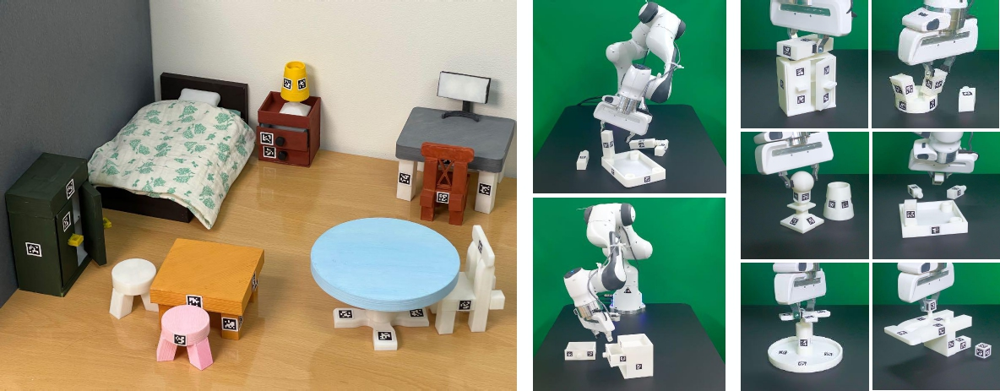

.. FurnitureBench documentation master file, created by
   sphinx-quickstart on Wed Mar 15 17:03:10 2023.
   You can adapt this file completely to your liking, but it should at least
   contain the root `toctree` directive.

FurnitureBench
==========================================

FurnitureBench is a reproducible real-world furniture assembly benchmark for long-horizon and complex robotic manipulation.
It includes a standardized environment setup and a large teleoperation dataset, consisting of over 200 hours of data.
Furthermore, we provide a simulator that enables easy and fast evaluation of algorithms.

This document includes benchmark setup instructions, links to resources (e.g. datasets, 3D models), and basic tutorials for FurnitureBench and FurnitureSim.
A general overview of FurnitureBench is available in our `project website <../index.html>`_.

If you use FurnitureBench in your research, please cite our paper:

.. code-block:: bibtex

    @inproceedings{heo2023furniturebench,
      title={FurnitureBench: Reproducible Real-World Benchmark for Long-Horizon Complex Manipulation},
      author={Minho Heo and Youngwoon Lee and Doohyun Lee and Joseph J. Lim},
      booktitle={Robotics: Science and Systems},
      year={2023}
    }

.. toctree::
   :maxdepth: 1
   :caption: Getting Started
   :hidden:

   getting_started/furniturebench_overview.rst
   getting_started/installation_guide.rst
   getting_started/installation_guide_furniture_sim.rst
   getting_started/dataset.rst

.. toctree::
   :maxdepth: 1
   :caption: Tutorials
   :hidden:

   tutorials/teleop_oculus_keyboard
   tutorials/furniture_bench.rst
   tutorials/furniture_sim
   tutorials/training_and_testing.rst

.. toctree::
   :maxdepth: 1
   :caption: References
   :hidden:

   references/code_organization.rst
   references/troubleshooting.rst
   references/development_roadmap.rst
   references/additional_information.rst

.. Indices and tables
.. ==================

.. * :ref:`genindex`
.. * :ref:`modindex`
.. * :ref:`search`
