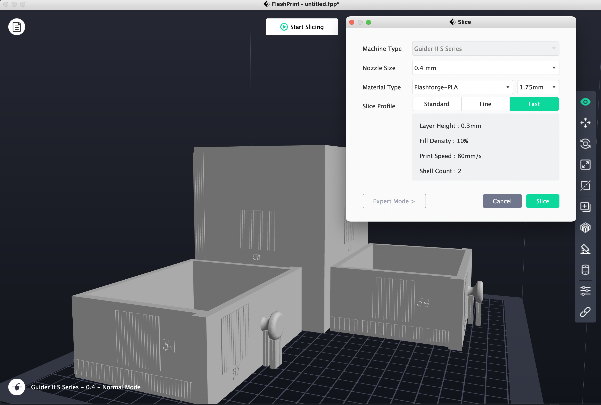

3D Printing 🖨️
================

This is an example of sliced 3D models using FlashPrint:

Estimated Time to Print
-----------------------

The table below summarizes an estimated time for 3D printing each furniture model. The actual time may vary based on the type of printer and setting.

+--------------------+--------------------------+
| Furniture Model    | Estimated time to print  |
+====================+==========================+
| lamp               | 12h 47m                  |
+--------------------+--------------------------+
| square_table       | 16h 3m                   |
+--------------------+--------------------------+
| desk               | 22h 39m                  |
+--------------------+--------------------------+
| round_table        | 14h 11m                  |
+--------------------+--------------------------+
| stool              | 9h  53m                  |
+--------------------+--------------------------+
| chair              | 17h 36m                  |
+--------------------+--------------------------+
| drawer             | 23h 55m                  |
+--------------------+--------------------------+
| cabinet            | 18h 47m                  |
+--------------------+--------------------------+
