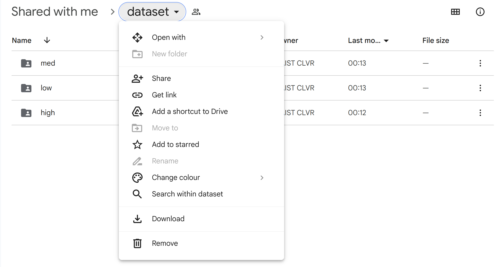

Dataset
=======

Furniture assembly is a complex, long-horizon manipulation task, which is very challenging to solve using reinforcement learning. To make our benchmark tractable, we provide **219.6 hours** of **5100** successful demonstrations collected using an Oculus Quest 2 controller and a keyboard.

Each furniture assembly task has three different levels with respect to the randomness in task initialization: `low`, `medium`, and `high`.

Download Dataset
~~~~~~~~~~~~~~~~

The FurnitureBench dataset is available on `our Google Drive <https://drive.google.com/drive/folders/1j59vFmgBsatu1PZK52HWX_9o5BCh_XDt?usp=sharing>`__:
::

   low               # Low randomness
     |- cabinet      # Demonstration files for cabinet
       |- 0.pkl
       |- 1.pkl
       |- ...
     |- chair        # Demonstration files for chair
     |- ...
   med               # Medium randomness
     |- cabinet
     |- ...
   high              # High randomness
     |- cabinet
     |- ...

For easy downloading, we also provide compressed datasets for each furniture model and randomness level under ``low_compressed``, ``med_compressed``, and ``high_compressed``. You can download our dataset:

.. code::

    pip install gdown

    python furniture_bench/scripts/download_dataset.py --untar --randomness [low|med|high] --furniture <furniture> --out_dir <path/to/data>

    # E.g., download lamp data with low randomness
    python furniture_bench/scripts/download_dataset.py --untar --randomness low --furniture lamp --out_dir ./furniture_dataset

    # E.g., download all furniture data with medium randomness
    python furniture_bench/scripts/download_dataset.py --untar --randomness med --furniture all --out_dir ./furniture_dataset

Dataset Size
~~~~~~~~~~~~

The size (in GB) of demonstrations of raw .pkl files for each furniture in each level is summarized below:

+--------------+-----+------+------+
| Furniture    | low | med  | high |
+==============+=====+======+======+
| lamp         | 26  | 27   | 11   |
+--------------+-----+------+------+
| square_table | 76  | 75   | 25   |
+--------------+-----+------+------+
| desk         | 46  | 57   | 25   |
+--------------+-----+------+------+
| drawer       | 43  | 39   | 11   |
+--------------+-----+------+------+
| cabinet      | 38  | 36   | 17   |
+--------------+-----+------+------+
| round_table  | 25  | 26   | 15   |
+--------------+-----+------+------+
| stool        | 37  | 42   | 19   |
+--------------+-----+------+------+
| chair        | 54  | 68   | 31   |
+--------------+-----+------+------+
| one_leg      | 112 | 129  | 69   |
+--------------+-----+------+------+
| Total        | 457 | 499  | 223  |
+--------------+-----+------+------+

Demonstration File Format
~~~~~~~~~~~~~~~~~~~~~~~~~

Each demonstration is stored in a ``.pkl`` file, containing a sequence of sensory inputs, actions, rewards, and other metadata:

::

   'furniture': Furniture name, e.g., 'lamp'
   'observations': List of observation dicts
     {
       'color_image1': Wrist camera image (224, 224, 3)
       'color_image2': Front camera image (224, 224, 3)
       'robot_state': {
         'ee_pos': EEF position (3,)
         'ee_quat': EEF orientation (4,)
         'ee_pos_vel': EEF linear velocity (3,)
         'ee_ori_vel': EEF angular velocity (3,)
         'joint_positions': Joint positions (7,)
         'joint_velocities': Joint velocities (7,)
         'joint_torques': Joint torques (7,)
         'gripper_width': Gripper width (1,)
       }
     }
   'actions': List of 8-D actions
   'rewards': List of rewards (1 if a furniture part is assembled; otherwise, 0)
   'skills': List of skill completion flags (1 if a skill is completed; otherwise, 0)

Download with rclone
~~~~~~~~~~~~~~~~~~~~

Sometime gdown might operate slowly, or reject your download request due to access quota limitations. In this case, you can utilize `rclone <https://rclone.org/>`__ to download the dataset.

1. Install `rclone <https://rclone.org/install/>`__.

2. Run ``rclone config`` to setup Google Drive remote:

.. code::

    No remotes found, make a new one?
    n) New remote
    s) Set configuration password
    q) Quit config
    n/s/q> n
    --------------------

    Enter name for new remote.
    name> furniture
    --------------------

    Choose a number from below, or type in your own value
    Storage> 18
    --------------------

    Two double "Enter" to skip client_id and client_secret
    --------------------

    Choose a number from below, or type in your own value.
    Press Enter to leave empty.
    scope> 2
    --------------------

    Enter a value. Press Enter to leave empty.
    service_account_file> "Enter"
    --------------------

    Edit advanced config?
    y) Yes
    n) No (default)
    y/n> n
    --------------------

    Use web browser to automatically authenticate rclone with remote?
    * Say Y if the machine running rclone has a web browser you can use
    * Say N if running rclone on a (remote) machine without web browser access
    If not sure try Y. If Y failed, try N.

    y) Yes (default)
    n) No
    y/n> n
    --------------------

    Option config_token.
    For this to work, you will need rclone available on a machine that has
    a web browser available.
    For more help and alternate methods see: https://rclone.org/remote_setup/
    Execute the following on the machine with the web browser (same rclone
    version recommended):
            rclone authorize "drive" "<Your config_token>"
    Then paste the result.
    Enter a value.
    config_token>

    *Writer's note*
    # Copy and past `rclone authorize "drive" "<Your config_token>"` in a machine with web browser
    # Login to your Google account
    # Allow rclone to access your Google Drive
    # Past the result to `config_token` in the terminal
    --------------------

    Configure this as a Shared Drive (Team Drive)?

    y) Yes
    n) No (default)
    y/n> n
    --------------------

    Keep this "furniture" remote?
    y) Yes this is OK (default)
    e) Edit this remote
    d) Delete this remote
    y/e/d> y
    --------------------

    Current remotes:

    Name                 Type
    ====                 ====
    furniture            drive

    e) Edit existing remote
    n) New remote
    d) Delete remote
    r) Rename remote
    c) Copy remote
    s) Set configuration password
    q) Quit config
    e/n/d/r/c/s/q> q
    --------------------

3. Connect to Google Drive remote by opening the `dataset Google Drive <https://drive.google.com/drive/u/1/folders/1j59vFmgBsatu1PZK52HWX_9o5BCh_XDt>`__ and clicking "Add a shortcut to Drive", "My Drive", and "Add".

4. The following Python script will download our dataset. Use ``--untar`` flag to decompress files after downloading.

.. code::

    python furniture_bench/scripts/download_dataset.py --randomness [low/med/high] --furniture <name of furniture> --out_dir <path/to/data> --use-rclone <--untar>

    # E.g., download lamp data with low randomness
    python furniture_bench/scripts/download_dataset.py --randomness low --furniture lamp --out_dir ./furniture_dataset --use-rclone

    # E.g., download all furniture data with medium randomness
    python furniture_bench/scripts/download_dataset.py --randomness med --furniture all --out_dir ./furniture_dataset --use-rclone
