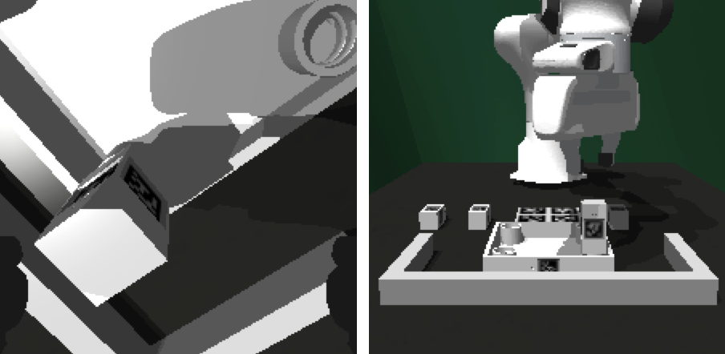

How to Use FurnitureSim
=======================

FurnitureSim Environments
-------------------------

Environment List
~~~~~~~~~~~~~~~~~~~~~~~~~~~

The following environments are available in FurnitureSim:
  * ``FurnitureSim-v0`` is the most basic environment. The observation includes 224x224 images from the wrist and front cameras and the robot state.
  * ``FurnitureSimFull-v0`` is mainly used for data collection, which serves all available observations: robot state, object poses, and color and depth images from the wrist, front, and rear cameras.
  * ``FurnitureSimImageFeature-v0`` uses the pre-trained image features (R3M or VIP) as observation instead of images.
  * ``FurnitureSimState-v0`` is a state-based environment.
  * ``FurnitureDummy-v0`` can be used if you only need the environment spec for pixel-based policies.
  * ``FurnitureImageFeatureDummy-v0`` can be used if you only need the environment spec for policies with pre-trained visual encoders.
  * ``FurnitureSimLegacy-v0`` is the deprecated environment used in the main paper.

.. warning::

    FurnitureSim is not yet optimized for multi-environment simulation. It will be soon supported.

FurnitureSim Configuration
~~~~~~~~~~~~~~~~~~~~~~~~~~~

FurnitureSim can be configured with the following arguments:

.. code::

    import furniture_bench
    import gym

    env = gym.make(
      "FurnitureSim-v0",
      furniture,                # Specifies the type of furniture [lamp | square_table | desk | drawer | cabinet | round_table | stool | chair | one_leg].
      num_envs=1,               # Number of parallel environments.
      obs_keys=None,            # List of observations.
      concat_robot_state=False, # Whether to return robot_state in a vector or dictionary.
      resize_img=True,          # If true, images are resized to 224 x 224.
      headless=False,           # If true, simulation runs without GUI.
      compute_device_id=0,      # GPU device ID for simulation.
      graphics_device_id=0,     # GPU device ID for rendering.
      init_assembled=False,     # If true, the environment is initialized with assembled furniture.
      np_step_out=False,        # If true, env.step() returns Numpy arrays.
      channel_first=False,      # If true, images are returned in channel first format.
      randomness="low",         # Level of randomness in the environment [low | med | high].
      high_random_idx=-1,       # Index of the high randomness level (range: [0-2]). Default -1 will randomly select the index within the range.
      save_camera_input=False,  # If true, the initial camera inputs are saved.
      record=False,             # If true, videos of the wrist and front cameras' RGB inputs are recorded.
      max_env_steps=3000,       # Maximum number of steps per episode.
      act_rot_repr='quat'       # Representation of rotation for action space. Options are 'quat' and 'axis'.
    )

FurnitureSim ``env.step``
~~~~~~~~~~~~~~~~~~~~~~~~~~~

The input and output of the APIs are as follows:

.. code:: python

    """
    # Input
    action: torch.Tensor or np.ndarray (shape: [num_envs, action_dim]) # Action space is 8-dimensional (3D EE delta position, 4D EE delta rotation (quaternion), and 1D gripper.Range to [-1, 1].

    # Output
    obs: Dictionary of observations. The keys are specified in obs_keys. The default keys are: ['color_image1', 'color_image2', 'robot_state'].
    reward: torch.Tensor or np.ndarray (shape: [num_envs, 1])
    done: torch.Tensor or np.ndarray (shape: [num_envs, 1])
    info: Dictionary of additional information.
    """
    env = gym.make(
        "FurnitureSim-v0",
        furniture='one_leg',
        num_envs=1,
    )

    ac = torch.tensor(env.action_space.sample()).float().to('cuda') # (1, 8) torch.Tensor
    ob, rew, done, _ = env.step(ac)

    print(ob.keys())                # ['color_image1', 'color_image2', 'robot_state']
    print(ob['robot_state'].keys()) # ['ee_pos', 'ee_quat', 'ee_pos_vel', 'ee_ori_vel', 'gripper_width']
    print(ob['color_image1'].shape) # Wrist camera of shape (1, 224, 224, 3)
    print(ob['color_image2'].shape) # Front camera os shape (1, 224, 224, 3)
    print(rew.shape)                # (1, 1)
    print(done.shape)               # (1, 1)

FurnitureSim Arguments
~~~~~~~~~~~~~~~~~~~~~~

- ``furniture`` can be one of ``[lamp|square_table|desk|drawer|cabinet|round_table|stool|chair|one_leg]``.

- ``randomness`` controls the randomness level of the initial states identically to FurnitureBench (see :ref:`How to use FurnitureBench`).

- ``init_assembled`` initializes FurnitureSim with fully assembled furniture models:

.. code:: bash

  python -m furniture_bench.scripts.run_sim_env --furniture <furniture> --init-assembled

.. figure:: ../_static/images/chair_assembled.jpg
    :width: 450px

    FurnitureSim initialized with an assembled `chair`.

- ``save_camera_input`` saves camera inputs of the first frame of an episode to ``sim_camera/``.

.. code:: bash

       python -m furniture_bench.scripts.run_sim_env --furniture <furniture> --init-assembled --save-camera-input

    Images from wrist and front camera.

- To get all available observations, initialize ``FurnitureSimFull-v0`` environment.
- ``resize_img`` will resize the images to 224 x 224. This argument is set to ``True`` by default. ``--high-res`` flag in ``run_sim_env.py`` is a negation of ``resize_img`` argument.

.. code:: bash

   python -m furniture_bench.scripts.run_sim_env --furniture <furniture> --init-assembled --save-camera-input --env-id FurnitureSimFull-v0 --high-res

.. figure:: ../_static/images/camera_view.jpg
    :width: 450px

    Wrist, front, and rear camera views of `square_table`.

- ``record`` records the wrist and front camera inputs and saves each episode in ``mp4`` to ``sim_record/``.

  .. figure:: ../_static/images/wrist_and_front.gif

     Example video.

Automated Assembly Script
-------------------------

We provide automated furniture assembly scripts. It currently supports only ``one_leg``.

..  ============== =================
..    Furniture     Assembly script
..  ============== =================
..       lamp              ⏳
..   square_table          ⏳
..       desk              ⏳
..   round_table           ⏳
..      stool              ⏳
..      chair              ⏳
..      drawer             ⏳
..     cabinet             ⏳
..     one_leg             ✔️
..  ============== =================

.. code:: bash

   python -m furniture_bench.scripts.run_sim_env --furniture one_leg --scripted

.. figure:: ../_static/images/assembly_script.gif
    :width: 50%
    :alt: Assembly script

**Data Collection:** Using our scripted policy, you can collect ``num-demos`` demonstrations. If you use Docker, make sure you mount the output data path to the Docker container before you collect data.

.. code:: bash

   python -m furniture_bench.scripts.collect_data --furniture <furniture> --scripted --is-sim --out-data-path <path/to/output> --compute-device-id <compute_device_id> --graphics-device-id <graphics_device_id> --num-demos <num_demos> --headless

   # E.g., collect 100 demonstrations for one_leg assembly
   python -m furniture_bench.scripts.collect_data --furniture one_leg --scripted --is-sim --out-data-path scripted_sim_demo --compute-device-id 0 --graphics-device-id 0 --num-demos 100 --headless

Here are some additional flags for ``collect_data.py``:

- ``--pkl-only``: The script ``collect_data.py``, by default, saves high-resolution color images in ``mp4`` and depth images in ``png`` along with pickle file. Set this flag if you want to save only ``pkl`` files.
- ``--save-failure``: The script ``collect_data.py``, by default, only saves successful trajectories when demonstrations are collected by assembly script. Set this flag if you want to save failed demonstrations as well.

To visualize a collected demonstration, use the following script with a demonstration path (i.e., a directory containing `pkl` and `mp4` files of one trajectory):

.. code:: bash

   python -m furniture_bench.scripts.show_trajectory --data-dir <path/to/data>

   # E.g., show a sequence of three camera inputs with metadata
   python -m furniture_bench.scripts.show_trajectory --data-dir scripted_sim_demo/one_leg/2022-12-22-03:19:48

.. tip::

    On your initial run, starting up FurnitureSim will take some time to construct SDF meshes.
    However, the next runs will be launched much faster with the cached SDF meshes.

Teleoperation in FurnitureSim
-----------------------------

FurnitureSim supports teleoperation using a keyboard and Oculus Quest 2.
You first need to set up Oculus Quest 2 by following :ref:`Teleoperation`.

To start FurnitureSim with teleoperation, execute the following command:

.. code::

    python -m furniture_bench.scripts.collect_data --furniture <furniture> --out-data-path <path/to/output> --is-sim

By default, both keyboard and Oculus Quest 2 will be used for teleoperation. You can also choose to use only keyboard (``--input-device keyboard``) or Oculus (``--input-device oculus``).
