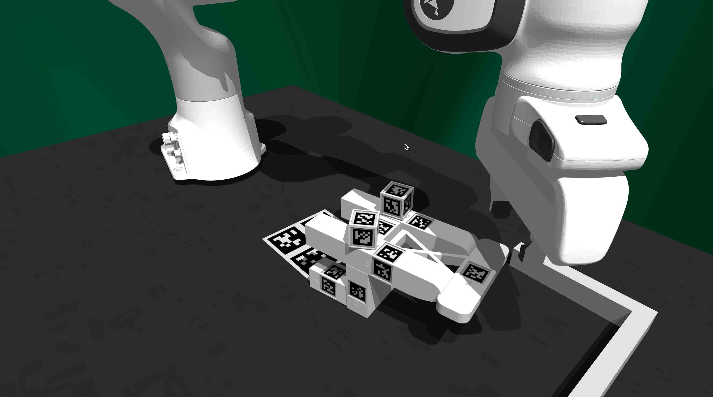
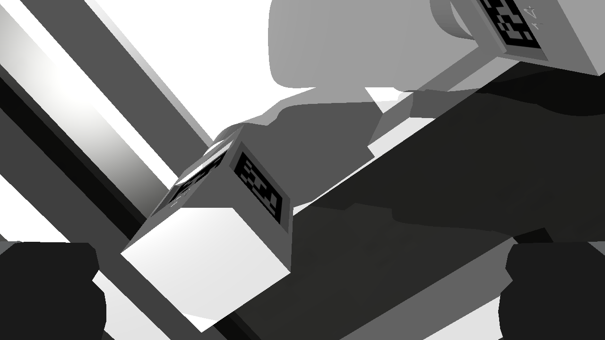
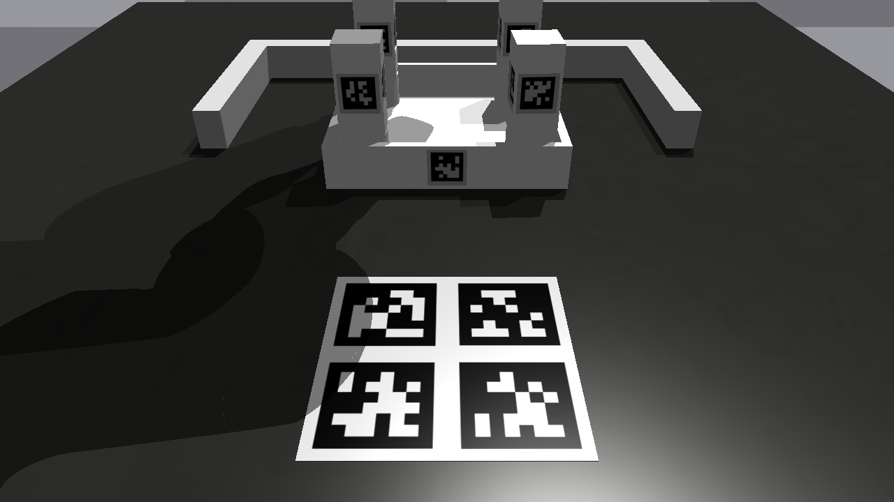
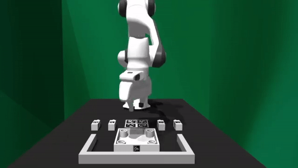

How to Use FurnitureSim
=======================

FurnitureSim Configuration
--------------------------

FurnitureSim can be configured with the following arguments:

.. code::

    import gym
    import furniture_bench

    env = gym.make(
      "FurnitureSim-v0",
      furniture=...,           # Specifies the type of furniture [lamp | square_table | desk | drawer | cabinet | round_table | stool | chair | one_leg].
      num_envs=1,              # Number of parallel environments.
      resize_img=True,         # If true, images are resized to 224 x 224.
      headless=False,          # If true, simulation runs without GUI.
      compute_device_id=0,     # GPU device ID for simulation.
      graphics_device_id=0,    # GPU device ID for rendering.
      init_assembled=False,    # If true, the environment is initialized with assembled furniture.
      np_step_out=False,       # If true, env.step() returns Numpy arrays.
      channel_first=False,     # If true, images are returned in channel first format.
      randomness="low",        # Level of randomness in the environment [low | med | high].
      high_random_idx=-1,      # Index of the high randomness level (range: [0-2]). Default -1 will randomly select the index within the range.
      save_camera_input=False, # If true, the initial camera inputs are saved.
      record=False             # If true, videos of the wrist and front cameras' RGB inputs are recorded.
    )

FurnitureSim Arguments
~~~~~~~~~~~~~~~~~~~~~~

- ``furniture`` can be one of ``[lamp|square_table|desk|drawer|cabinet|round_table|stool|chair|one_leg]``.

- ``randomness`` controls the randomness level of the initial states, identically to FurnitureBench (see :ref:`How to use FurnitureBench`).

- ``init_assembled`` initializes FurnitureSim with fully assembled furniture models:

.. code:: bash

  python -m furniture_bench.scripts.run_sim_env --furniture <furniture> --init-assembled

    FurnitureSim initialized with an assembled chair.

- ``save-camera-input`` saves camera inputs of the first frame of an episode to ``sim_camera/``.

.. code:: bash

   python -m furniture_bench.scripts.run_sim_env --furniture <furniture> --init-assembled --save-camera-input

.. |image2| image:: ../_static/images/front_sim.png
    :width: 215px
    :height: 120px

+--------------+--------------+-------------+
| |image1|     | |image2|     |  |image3|   |
+==============+==============+=============+
| Wrist camera | Front camera | Rear camera |
+--------------+--------------+-------------+

- ``record`` records the wrist and front camera inputs and saves each episode in ``mp4`` to ``sim_record/``.

  .. figure:: ../_static/images/wrist_and_front.gif

     Example video.

Automated Assembly Script
-------------------------

We provide automated furniture assembly scrips. It currently supports only ``one_leg``.

..  ============== =================
..    Furniture     Assembly script
..  ============== =================
..       lamp              ⏳
..   square_table          ⏳
..       desk              ⏳
..   round_table           ⏳
..      stool              ⏳
..      chair              ⏳
..      drawer             ⏳
..     cabinet             ⏳
..     one_leg             ✔️
..  ============== =================

.. code:: bash

   python -m furniture_bench.scripts.run_sim_env --furniture one_leg --scripted

Using this assembly script, you can collect ``num-demos`` demonstrations. Before you collect data, make sure you mount the output data path to the docker container.

.. code:: bash

   python -m furniture_bench.scripts.collect_data --furniture <furniture> --scripted --is-sim --out-data-path <path/to/output> --gpu-id <gpu_id> --num-demos <num_demos> --headless

   # E.g.,
   python -m furniture_bench.scripts.collect_data --furniture one_leg --scripted --is-sim --out-data-path /hdd/scripted_sim_demo --gpu-id 0 --num-demos 100 --headless

To visualize a collected demonstration, use the following script with a demonstration path (a directory contains `pkl` and `mp4` files of one trajectory):

.. code:: bash

   python -m furniture_bench.scripts.show_trajectory --data-dir <path/to/data>

   # E.g.,
   python -m furniture_bench.scripts.show_trajectory --data-dir /hdd/scripted_sim_demo/one_leg/2022-12-22-03:19:48

.. tip::

    On your initial run, starting up FurnitureSim will take some time to construct SDF meshes.
    However, following runs will be launched much faster with the cached SDF meshes.

Teleoperation in FurnitureSim
-----------------------------

FurnitureSim supports teleoperation using a keyboard and Oculus Quest 2.
You first need to set up Oculus Quest 2 by following :ref:`Teleoperation`.

To start FurnitureSim with teleoperation, execute the following command:

.. code::

    python -m furniture_bench.scripts.collect_data --furniture <furniture> --out-data-path <path/to/output> --input-device oculus --is-sim
