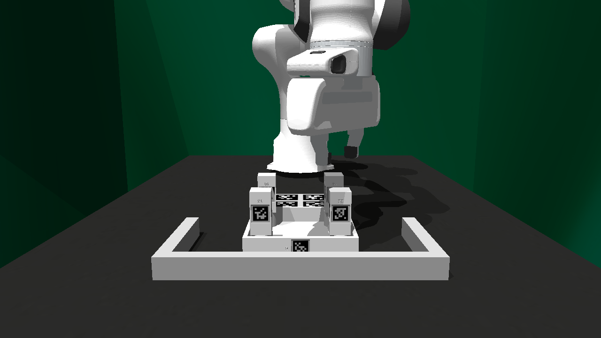

How to Use FurnitureSim
=======================

FurnitureSim Configuration
~~~~~~~~~~~~~~~~~~~~~~~~~~

FurnitureSim can be configured with the following arguments:

.. code::

    import gym
    import furniture_bench

    env = gym.make(
      "Furniture-Sim-Env-v0",
      furniture=...,           # string, [lamp | square_table | desk | drawer | cabinet | round_table | stool | chair | one_leg].
      num_envs=...,            # integer, number of parallel environments.
      init_assembled=...,      # boolean, initialize the environment with assembled furniture.
      resize_img=...,          # boolean, resize images to 224 x 224.
      headless=..,             # boolean, run the simulation without GUI.
      save_camera_input=...,   # boolean, save camera input images at the beginning of the episode.
      randomness=...,          # string, [low | med | high].
      high_random_idx=...      # integer, index of the high randomness environment.
    )

Automated Assembly Script
~~~~~~~~~~~~~~~~~~~~~~~~~

We provide automated furniture assembly scrips. It currently supports only ``one_leg``.

..  ============== =================
..    Furniture     Assembly script
..  ============== =================
..       lamp              ⏳
..   square_table          ⏳
..       desk              ⏳
..   round_table           ⏳
..      stool              ⏳
..      chair              ⏳
..      drawer             ⏳
..     cabinet             ⏳
..     one_leg             ✔️
..  ============== =================

.. code:: bash

   python furniture_bench/scripts/run_sim_env.py --furniture one_leg --scripted

.. figure:: ../_static/images/assembly_script.gif
    :width: 50%
    :align: left
    :alt: Assembly script

.. tip::

    On your initial run, starting up the simulator will take some time because it needs to construct SDF meshes.
    However, following runs will be much quicker as the simulator will load the cached SDF meshes.

Using this assembly script, you can collect demonstration data:

.. code:: bash

   python furniture_bench/scripts/collect_data.py --furniture <furniture> --scripted --is-sim --out-data-path <path/to/output> --gpu-id <gpu_id> --headless  # Make sure you mount the output data path to the docker container.

   # E.g.
   python furniture_bench/scripts/collect_data.py --furniture one_leg --scripted --is-sim --out-data-path /hdd/scripted_sim_demo  --gpu-id 0 --headless

To visualize a collected demonstration, use the following script with a demonstration path:

.. code:: bash

   python furniture_bench/scripts/show_trajectory.py --data-dir <path/to/saved/data/dir>

   # E.g.
   python furniture_bench/scripts/show_trajectory.py --data-dir /hdd/scripted_sim_demo/one_leg/2022-12-22-03:19:48

Teleoperation in FurnitureSim
~~~~~~~~~~~~~~~~~~~~~~~~~~~~~

FurnitureSim supports teleoperation using a keyboard and Oculus Quest 2.
You first need to set up Oculus Quest 2 by following :ref:`Teleoperation`.

To start FurnitureSim with teleoperation, execute the following command:

.. code::

    python furniture_bench/scripts/collect_data.py --furniture <furniture> --out-data-path <path/to/save/data> --input-device oculus --is-sim

Assembled Furniture
~~~~~~~~~~~~~~~~~~~

To check meshes and physics parameters of a furniture model, you can initialize FurnitureSim with the fully assembled furniture using ``--init-assembled``:

.. code:: bash

   python furniture_bench/scripts/run_sim_env.py --furniture <furniture> --init-assembled

Save Initial Camera Images
~~~~~~~~~~~~~~~~~~~~~~~~~~

For debugging, you can save the initial camera inputs in ``sim_camera/``:

.. code:: bash

   python furniture_bench/scripts/run_sim_env.py --furniture <furniture> --init-assembled --save-camera-input

.. |image1| image:: ../_static/images/wrist_sim.png
    :width: 215px
    :height: 120px

+--------------+--------------+-------------+
| Wrist camera | Front camera | Rear camera |
+==============+==============+=============+
| |image1|     | |image2|     |  |image3|   |
+--------------+--------------+-------------+
