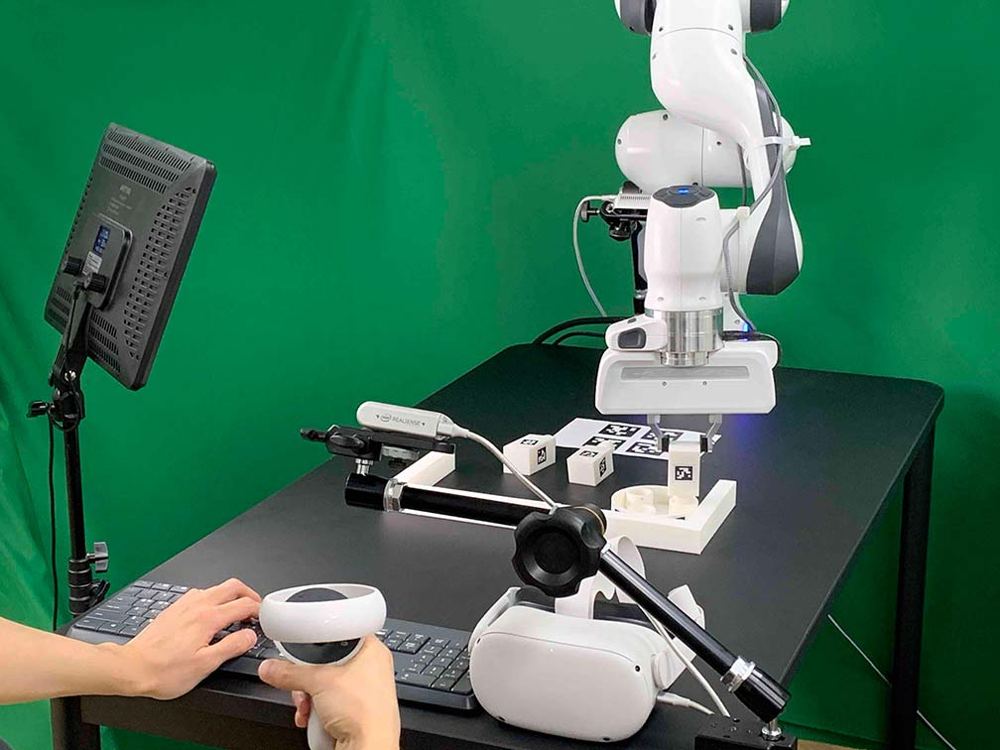

Data Collection using Oculus/Keyboard
=====================================

Our system supports Oculus Quest 2 controller and keyboard for demonstration collections.
After setting up the environment (workspace, cameras, Client, Server), you are ready to collect the data.

.. note::

    When you use Docker, make sure to mount a storage to save your data (:ref:`Run Client`). Otherwise, the collected data will be deleted once you close the docker container.

Setup Oculus Quest 2
~~~~~~~~~~~~~~~~~~~~~
Setup the Oculus Quest 2 when you run it for the first time.

1. Turn on the Oculus Quest 2.
2. Download the Oculus app (Meta Quest) on your phone.
3. Create an Oculus account.
4. Pair Your Headset
5. Go to headset settings and select "Developer Mode".
6. Wear the headset and go to "Settings > System > Power" and set "Auto Sleep Headset to 4 hours"
7. Go to "settings > System > Developer" and disable "Guardian"
8. Connect the Oculus Quest 2 to your computer with USB-A to USB-C cable.

Run Client with Docker Volume
~~~~~~~~~~~~~~~~~~~~~~~~~~~~~

For the run client and run server, please refer to :ref:`Run Client` and :ref:`Run Server`.

  .. code:: bash

    # The default control device is Oculus + keyboard.
    python furniture_bench/scripts/collect_data.py --furniture {furniture} --out-data-path {/path/to/save/data}

    # only use keyboard
    python furniture_env/scripts/collect_data.py --furniture {furniture} --device keyboard

.. note::

    When you first run the scripts, prompt in Oculus Quest 2 will ask you to allow the connection.
    Wear the headset and press the "Allow" button.

4. The command above will launch GUI initialization tool. Place furniture parts in reset positions as guided by GUI tool.

.. image:: ../_static/images/initialization_tool.gif
    :width: 70%
    :align: center
    :alt: GUI Tool

5. After completing the trajectory, press "A" to save it as successful. If the trajectory fails to achieve the task, press "B." Both "A" and "B" save the trajectory, but if "B" is pressed, the metadata will be marked as "failed."

.. tip::
    - The data will be saved at {path/to/save/data/<furniture_name>/<current_timestamp>} directory.
    - The data directory contains pkl-serialized Python dictionary, mp4, and png.

    For example,

    .. code::

        |- 2023-01-16-10:48:51
          |- 2023-01-16-10:48:51.pkl                  # Demonstration data         (224x224 images, actions, rewards, etc.)
          |- 2023-01-16-10:48:51_color_image1.mp4     # Wrist camera RGB images    (1280x720)
          |- 2023-01-16-10:48:51_color_image2.mp4     # Front camera RGB images    (1280x720)
          |- 2023-01-16-10:48:51_color_image3.mp4     # Rear camera RGB images     (1280x720)
          |- 2023-01-16-10:48:51_depth_image1         # Wrist camera depth images  (1280x720)
          |- 2023-01-16-10:48:51_depth_image2         # Front camera depth images  (1280x720)
          |- 2023-01-16-10:48:51_depth_image3         # Rear camera depth images   (1280x720)

    - mp4 files contains original resolution RGB images, and png files contains depth images from all three cameras.
    - The structure of the .pkl files is described in :ref:`Demonstration data format`
