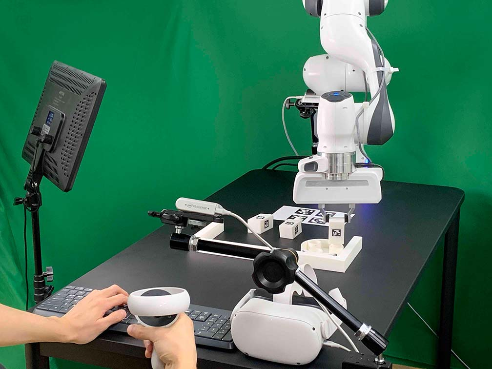

Teleoperation
=============

Our system supports Oculus Quest 2 controller and keyboard for teleoperation.

Setup Oculus Quest 2
~~~~~~~~~~~~~~~~~~~~

You need to set up Oculus Quest 2 on its first use.

1. Turn on Oculus Quest 2.
2. Download the Oculus app (Meta Quest) on your phone.
3. Create an Oculus account.
4. Pair Your Headset.
5. Go to headset settings and select "Developer Mode."
6. Wear the headset and go to "Settings > System > Power" and set "Auto Sleep Headset to 4 hours".
7. Go to "Settings > System > Developer" and disable "Guardian."
8. Connect your Oculus Quest 2 to the client computer with USB-A to USB-C cable.

Start Teleoperation
~~~~~~~~~~~~~~~~~~~

1. Before starting teleoperation, check whether the server daemon is running (see :ref:`Run Server`).

2. In the client computer, execute the following script:

.. code:: bash

  python furniture_bench/scripts/collect_data.py --furniture <furniture> --out-data-path </path/to/save/data>

.. note::

    When you use Docker, make sure to mount the storage to save your data (:ref:`Run Client`). Otherwise, the collected data will be deleted once you close the docker container.

3. (Optional) If you want to use only a keyboard, add an argument ``--device keyboard``:

.. note::

    Oculus Quest 2 sometimes asks permission for connection. So, if the controller does not work, wear the headset and press the "Allow" button.

4. The command above will launch a GUI, as shown below. To start data collection, place furniture parts in their reset positions shown in the tool.

.. figure:: ../_static/images/initialization_tool.gif
    :width: 70%
    :align: center
    :alt: GUI Tool

4. After completing an episode, press "A" ("B") to save the trajectory labeled as "success" ("fail").

.. tip::
    - The data will be saved at ``<out-data-path>/<furniture_name>/<current_timestamp>/``.
    - Each episode is stored as follows:

    .. code::

        |- 2023-01-16-10:48:51
          |- 2023-01-16-10:48:51.pkl                  # Demonstration data         (224x224 images, actions, rewards, etc.)
          |- 2023-01-16-10:48:51_color_image1.mp4     # Wrist camera RGB images    (1280x720)
          |- 2023-01-16-10:48:51_color_image2.mp4     # Front camera RGB images    (1280x720)
          |- 2023-01-16-10:48:51_color_image3.mp4     # Rear camera RGB images     (1280x720)
          |- 2023-01-16-10:48:51_depth_image1         # Wrist camera depth images  (1280x720)
          |- 2023-01-16-10:48:51_depth_image2         # Front camera depth images  (1280x720)
          |- 2023-01-16-10:48:51_depth_image3         # Rear camera depth images   (1280x720)

    - The contents of a ``.pkl`` file are described in :ref:`Demonstration file format`.
